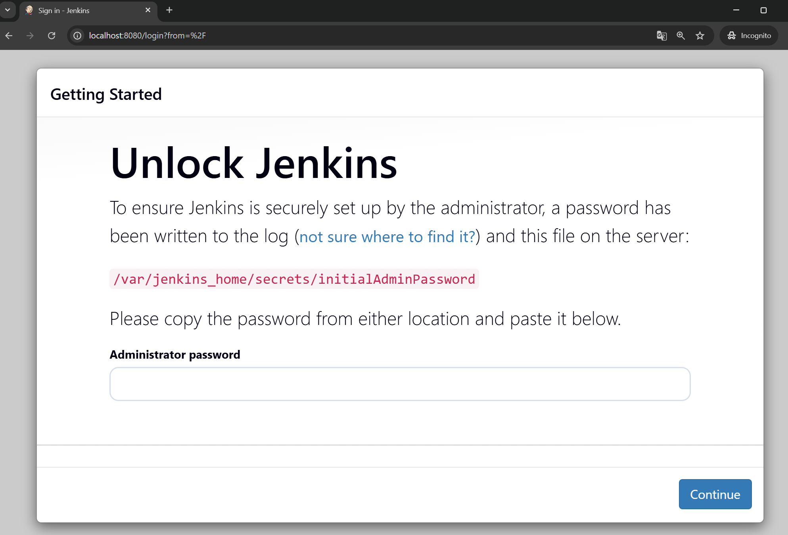

## Task 1: Deploy Jenkins

### Step 1
Fork the GitHub project to your personal account - https://github.com/spring-guides/gs-spring-boot


### Step 2
 - Create a working directory (mkdir 03_jenkins) with a 03_jenkins/docker-compose.yml file.
 - Copy the following code to docker-compose.yml:
```yaml
services:
  jenkins-docker:
    image: docker:dind
    container_name: jenkins-docker
    privileged: true
    environment:
      - DOCKER_TLS_CERTDIR=/certs
    networks:
      jenkins:
        aliases:
          - docker
    volumes:
      - jenkins-docker-certs:/certs/client
      - jenkins-data:/var/jenkins_home
    ports:
      - "2376:2376"
    command: ["--storage-driver", "overlay2"]

  jenkins:
    image: jenkins/jenkins:latest
    container_name: jenkins
    restart: on-failure
    environment:
      - DOCKER_HOST=tcp://docker:2376
      - DOCKER_CERT_PATH=/certs/client
      - DOCKER_TLS_VERIFY=1
    networks:
      - jenkins
    ports:
      - "8080:8080"
      - "50000:50000"
    volumes:
      - jenkins-data:/var/jenkins_home
      - jenkins-docker-certs:/certs/client:ro
    depends_on:
      - jenkins-docker

volumes:
  jenkins-docker-certs:
  jenkins-data:
networks:
  jenkins:
    driver: bridge
```

### Step 3
- Run Docker (assuming it's already installed)
- Inside the working directory (where docker-compose.yml is located), open a terminal and run the following command:
`docker-compose up -d`
- Run the `docker ps` command to verify that 2 containers are running and healthy. The result should be similar to the image below:
  

### Step 4
- Open a browser and go to http://localhost:8080/
 
- To get the password, open a terminal and run the following command:
 `docker exec jenkins cat /var/jenkins_home/secrets/initialAdminPassword`
- Enter the password in the "Administrator password" field and install the suggested plugins
- Set your username and password
- After completing all steps, you should see the home screen:
  


## Task 2: Configure Freestyle Job

### Step 1: Create a New Job
- Click "+ New Item"
- Enter the name "Simple Freestyle Job" and select "Freestyle project"
  
- [Optional] On the next screen, set up the General info

### Step 2: Set Up Source Code Management
  - Set up the URL to your fork of the project
  - Check that the branch name matches (*by default it could be master)
  

### Step 3: Set Up Build Steps
  - Add a single step "Execute shell"
  - Inside the Command field, insert the following code:
  ```
  cd complete
  chmod +x mvnw
  ./mvnw clean install
  ```

### Step 4: Set Up Post-build Actions
 - Add "Archive the artifacts"
 - Set Files to archive: `complete/target/*.jar`

### Step 5: Build and Download Artifact
 - Save the job
 - Click "Build Now"
 - Go to the last successful build
   
 - Download `spring-boot-complete-0.0.1-SNAPSHOT.jar`

### Step 6 [Optional]: Run Artifact on Windows
- Install JDK 21 https://www.oracle.com/ua/java/technologies/downloads/#jdk21-windows
- Open a terminal and navigate to the folder containing `spring-boot-complete-0.0.1-SNAPSHOT.jar`
- Run the command `java -jar .\spring-boot-complete-0.0.1-SNAPSHOT.jar --server.port=8081`
  
