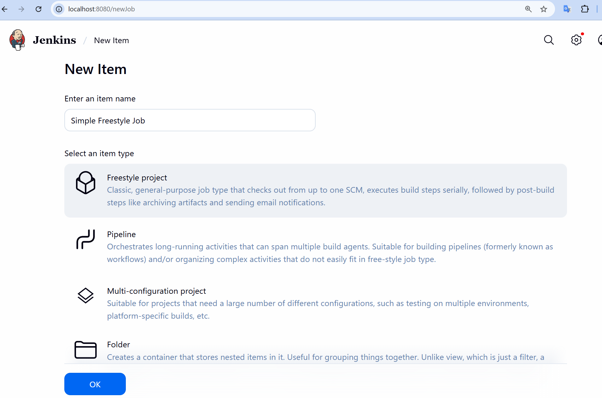
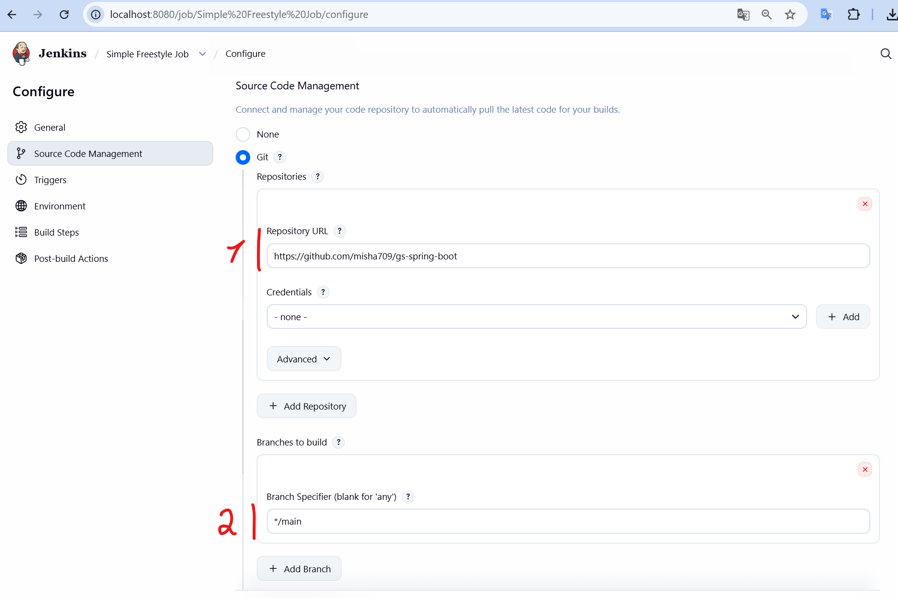
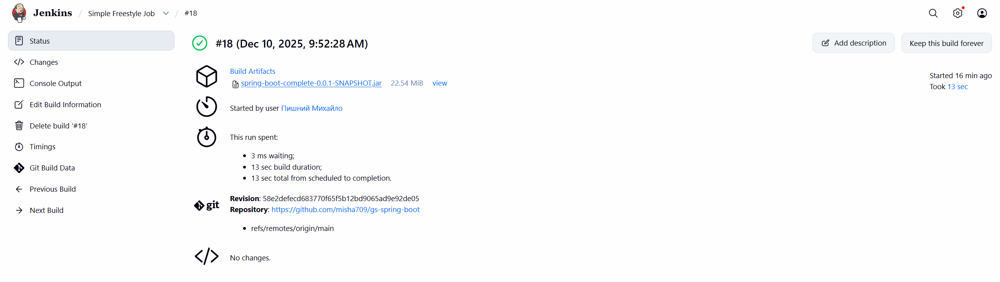
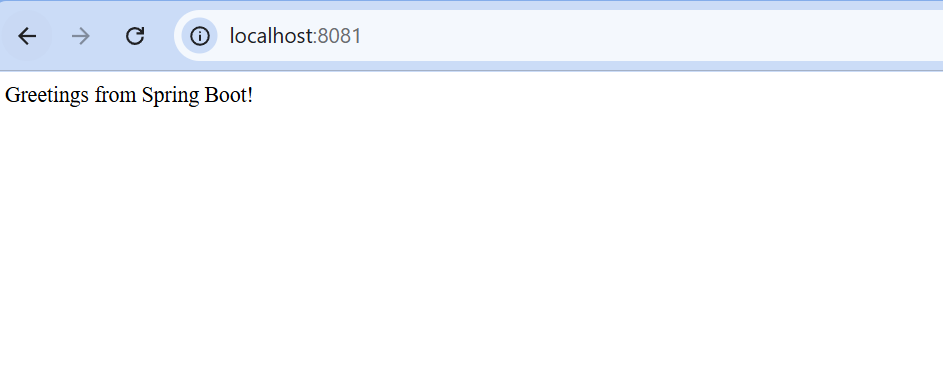

#### [Back to Readme](../../Readme.md)

## Task 2: Configure Freestyle Job

### Step 1: Create a New Job
- Click "+ New Item"
- Enter the name "Simple Freestyle Job" and select "Freestyle project"
  
- [Optional] On the next screen, set up the General info

### Step 2: Set Up Source Code Management
  - Set up the URL to your fork of the project
  - Check that the branch name matches (*by default it could be master)
  

### Step 3: Set Up Build Steps
  - Add a single step "Execute shell"
  - Inside the Command field, insert the following code:
  ```
  cd complete
  chmod +x mvnw
  ./mvnw clean install
  ```

### Step 4: Set Up Post-build Actions
 - Add "Archive the artifacts"
 - Set Files to archive: `complete/target/*.jar`

### Step 5: Build and Download Artifact
 - Save the job
 - Click "Build Now"
 - Go to the last successful build
   
 - Download `spring-boot-complete-0.0.1-SNAPSHOT.jar`

### Step 6: Run Artifact on Windows
- Install JDK 21 https://www.oracle.com/ua/java/technologies/downloads/#jdk21-windows
- Open a terminal and navigate to the folder containing `spring-boot-complete-0.0.1-SNAPSHOT.jar`
- Run the command `java -jar .\spring-boot-complete-0.0.1-SNAPSHOT.jar --server.port=8081`
  
