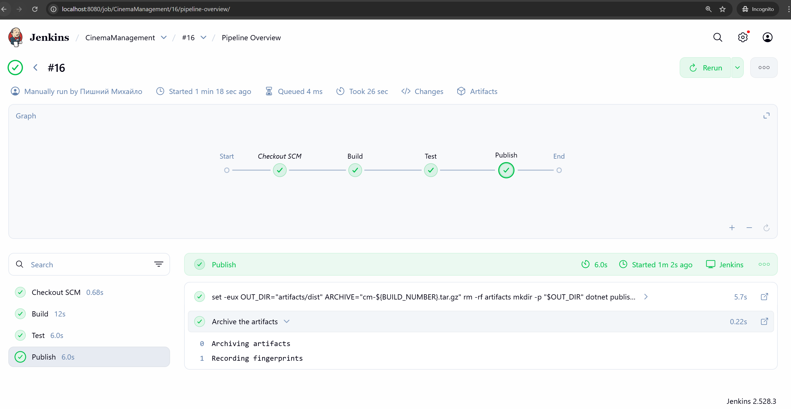
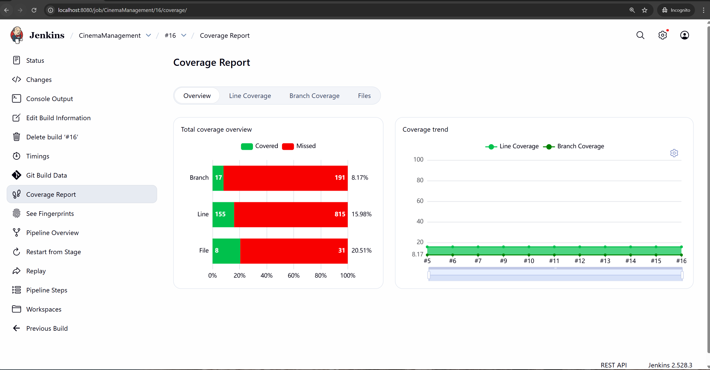
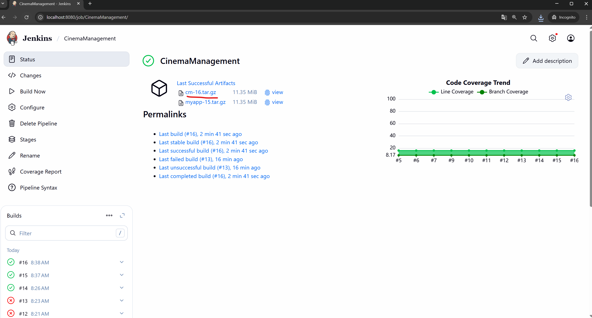
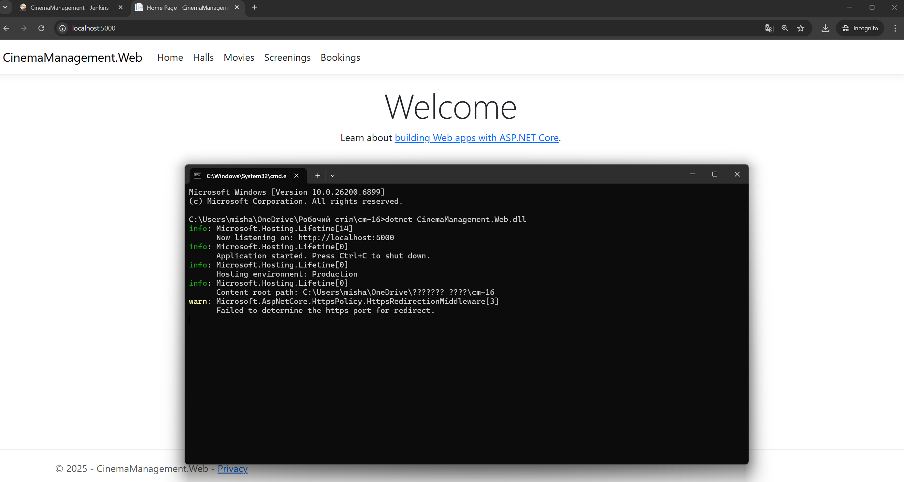

#### [Back to Readme](../../Readme.md)

## Task 3: Configure Declarative Job Pipeline

For declarative pipeline we will deploy a .NET project. For this purpose, we need to install dotnet to our Jenkins.

### Step 0 Install dotnet to Jenkins
By default, the Jenkins image does not contain dotnet installed. You could use a plugin but often this is limited by the plugin version. 
So to install Jenkins, we need to create a modified image that does this.
 - Create [Dockerfile](./Dockerfile) with preinstalled .NET
 - Update docker-compose.yml to change image to build
   ```yml
    jenkins:
      image: . # remove this line
      build: # add this
        context: .
        dockerfile: Dockerfile
   ```
 - Remove old Jenkins container, go to previous working dir (Task1) and run `docker-compose down`
 - [optional] To start fresh, you need to delete existing Jenkins volumes
 - Run `docker-compose up -d`
 - Install Jenkins plugin "Coverage"

### Step 1 Create Jenkinsfile inside codebase
https://github.com/misha709/CinemaManagement/blob/jenkins/CinemaManagement.Web/Jenkinsfile

### Step 2 Create new job
- Create new job "CinemaManagement" and select type "Pipeline"
- Select Section "Pipeline"
  - Definition: "Pipeline script from SCM" ([Jenkinsfile](./Jenkinsfile) will be in the same dir as codebase)
  - SCM: "Git"
  - Repositories: "https://github.com/misha709/CinemaManagement"
  - Branch Specifier: "*/jenkins"
  - Script Path: "./CinemaManagement.Web/Jenkinsfile"


### Step 3 Run build







