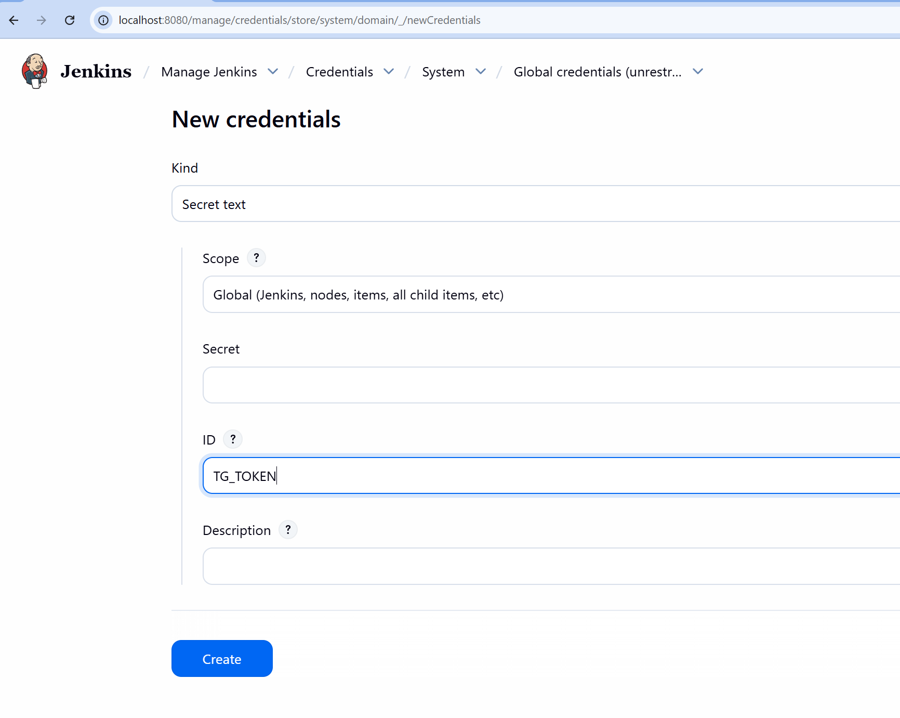
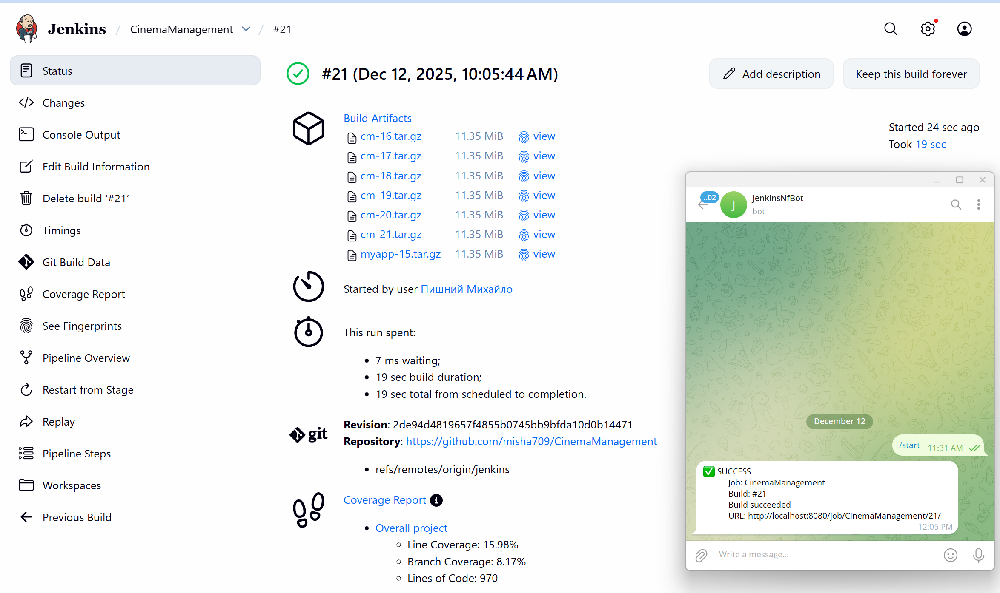
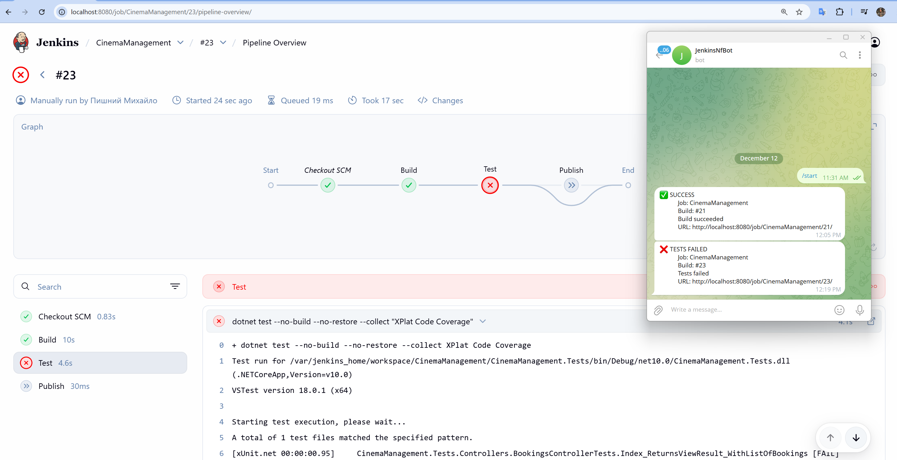

#### [Back to Readme](../../Readme.md)

## Task 4: Add Telegram Notifications

To add Telegram notifications we could use different approaches one of them plugin. 
But as plugin looks outdated we could use workeround to send simple curl requests to Telegram.

### Step 1 Create telegram bot
- Open Telegram and find BotFather
- Create new bot by typing `/newbot`
- Keep secret


### Step 2 Update pipeline (use Jenkinsfile from previous [Task3](../task3/Jenkinsfile))
- Add new envirovment section and function pipeline.
 ```groovy
    pipeline {
        agent any
        environment {
            TG_TOKEN    = credentials('tg-bot-token')
            TG_CHAT_IDS = credentials('tg-chat-ids')
        }
        stages { }
    }
    def notifyTelegram(String status, String details) {
    withEnv(["TG_STATUS=${status}", "TG_DETAILS=${details}"]) {
        sh '''
        set +x

        TEXT="${TG_STATUS}
                Job: ${JOB_NAME}
                Build: #${BUILD_NUMBER}
                ${TG_DETAILS}
                URL: ${BUILD_URL}"

        echo "$TG_CHAT_IDS" | tr ',' '\n' | while read CHAT_ID; do
            [ -n "$CHAT_ID" ] && curl -sS -X POST "https://api.telegram.org/bot$TG_TOKEN/sendMessage" \
            -d "chat_id=$CHAT_ID" \
            --data-urlencode "text=$TEXT"
        done
        '''
    }
    }
 ```


### Step 3: Set Up Global Credentials
Navigate to **Manage Jenkins** → **Credentials** → **System** → **Global credentials** and create two secrets:



**Important:** Never commit secrets or sensitive information to your pipeline code!

#### Create Secret 1: Bot Token
- **Kind:** Secret text
- **ID:** `tg-bot-token`
- **Secret:** Paste your bot token from BotFather
- **Description:** Telegram bot token for notifications

#### Create Secret 2: Chat IDs
- **Kind:** Secret text
- **ID:** `tg-chat-ids`
- **Secret:** Your chat ID(s), comma-separated for multiple chats (e.g., `123456789,987654321`)
- **Description:** Telegram chat IDs to receive notifications

#### How to Get Your Chat ID:
1. Start your bot by finding it in Telegram and sending `/start`
2. Visit `https://api.telegram.org/bot<TG_TOKEN>/getUpdates` in your browser (replace `<TG_TOKEN>` with your actual bot token)
3. Look for `result[0].message.chat.id` in the response:

```json
{
  "ok": true,
  "result": [
    {
      "update_id": 77777,
      "message": {
        "message_id": 2,
        "from": { .... },
        "chat": {
          "id": <YOUR_CHAT_ID>
        },
        "date": 1765531875,
        "text": "/start",
        "entities": [
          {
            "offset": 0,
            "length": 6,
            "type": "bot_command"
          }
        ]
      }
    }
  ]
}
```

### Step 4: Add Post Actions to Pipeline Stages
Update your Jenkinsfile to add notification handlers for different build outcomes.

#### Test Stage with Failure Notification:
```groovy
stage('Test') {
  steps {
    sh 'dotnet test --no-build --no-restore --collect "XPlat Code Coverage"'
  }
  post {
    always {
      recordCoverage(tools: [[parser: 'COBERTURA', pattern: '**/*.xml']], sourceDirectories: [[path: 'CinemaManagement.Tests/TestResults']])
    }
    failure {
      script { notifyTelegram("❌ TESTS FAILED", "Tests failed") }
    }
  }
}
```

#### Publish Stage with Multiple Notifications:
```groovy
stage('Publish') {
  steps { }
  post {
    success {
      archiveArtifacts artifacts: '*.tar.gz', fingerprint: true
      script { notifyTelegram("✅ SUCCESS", "Build succeeded") }
    
    }
    failure {
      script { notifyTelegram("❌ FAILED", "Build failed") }
    }
    aborted {
      script { notifyTelegram("⚪ ABORTED", "Build aborted") }
    }
    unstable {
      script { notifyTelegram("🟡 UNSTABLE", "Build unstable") }
    }
  }
}
``` 

### Result

After setting up the pipeline, you will receive Telegram notifications for various build events:

#### Successful Build Notification:


#### Test Failure Notification:

