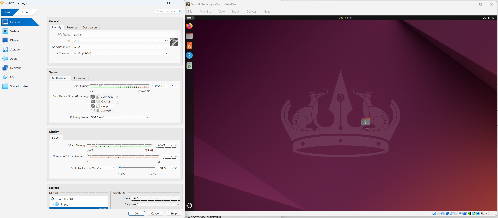
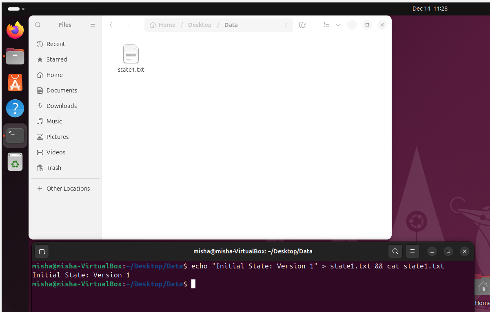
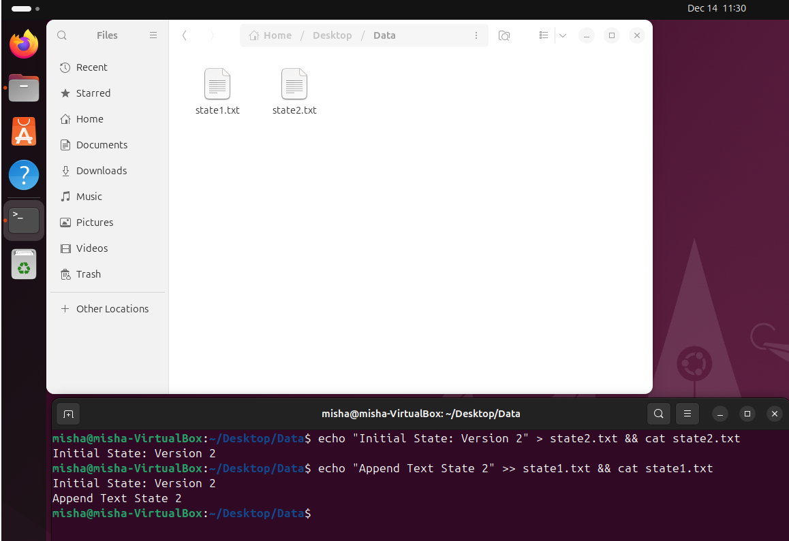
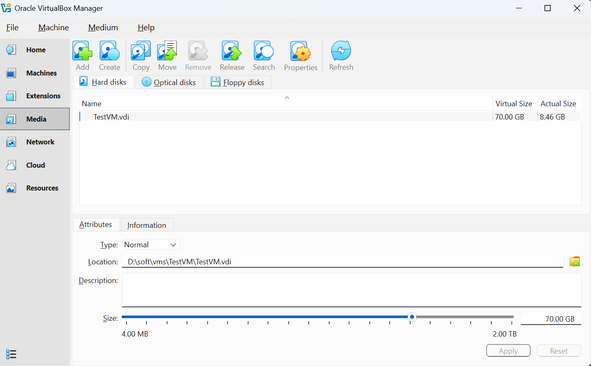
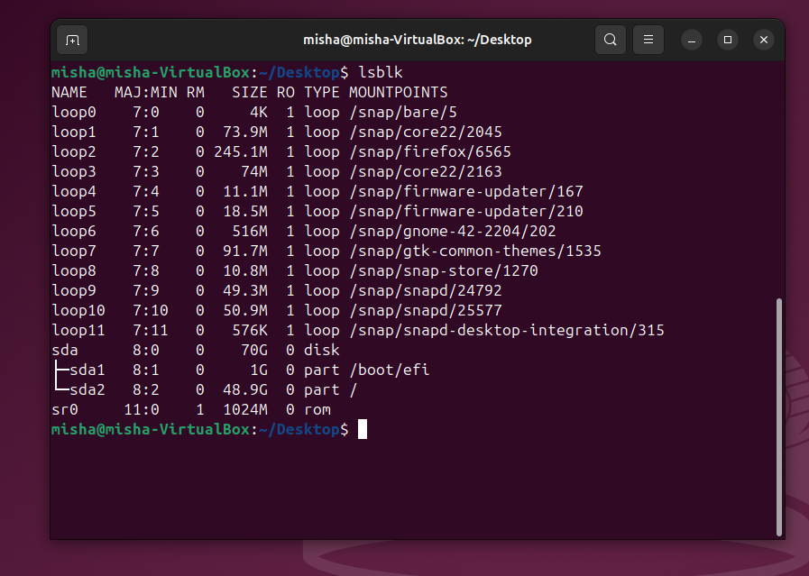
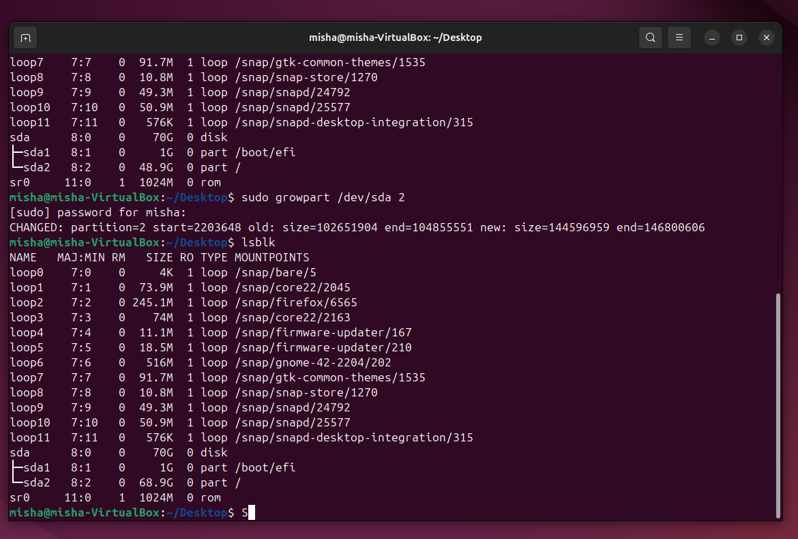
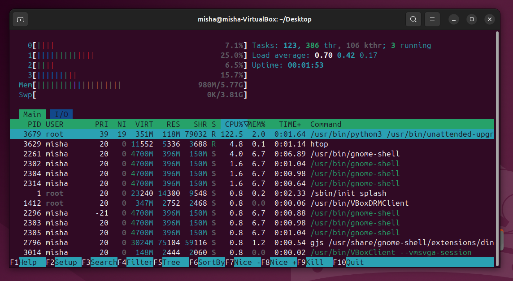

#### [Back to Readme](../Readme.md)

## Task 1: Install and Configure VirtualBox with Ubuntu VM on Windows

### Step 1: Install VirtualBox
- Go to https://www.virtualbox.org/wiki/Downloads
- Download the latest installation package for your platform
- Install VirtualBox

### Step 2 - 3: Create and configure New VM

Create a new virtual machine with the following specifications:

#### VirtualBox VM Settings

**General:**
- **Name:** TestVM
- **OS Type:** Ubuntu (64-bit)

**System:**
- **Memory:** 4096 MB
- **CPU:** 2 cores
- **EFI:** Enabled

**Storage:**
- **Disk:** TestVM.vdi
- **Disk Size:** 50 GB
- **Controller:** SATA

**Network:**
- **Mode:** Bridged Adapter

### Step 4: Download and Attach Ubuntu ISO
- Go to https://ubuntu.com/download/server#manual-install-tab
- Download `Ubuntu 24.04.3 LTS` (ISO file)
- Open the VM settings: **Settings → Storage → Controller: IDE**
- Select the optical drive and attach the downloaded ISO file
- Start the VM
- Complete the installation using the default settings

**Result:**

### Step 5: Create and Restore VM Snapshot

#### Create a Snapshot:
1. Select your VM in VirtualBox Manager
2. Click **Menu → Machine → Take Snapshot**
3. Provide a name and click **OK**

#### Test Restoration:
Make some changes to your VM (install packages, create files, etc.)

#### Restore from Snapshot:
1. Power off the VM
2. Go to **Menu → Machine → Tools → Snapshots** (Ctrl+Shift+S)
3. Right-click the snapshot and select **Restore**
4. Start the VM

### Step 6: Resize VM Resources

#### Subtask 1: Increase Disk Size
1. Power off the VM
2. Go to **File → Virtual Media Manager**
3. Select your hard disk and click **Properties**
4. Adjust the disk size slider and click **Apply**

5. Power on the VM
6. In the terminal, run `lsblk` to check disk partitions

7. You should see unallocated space. If not, reboot the system and remove any snapshots
8. Expand the partition by running: `sudo growpart /dev/sda 2`
9. Resize the filesystem: `sudo resize2fs /dev/sda2`

#### Subtask 2: Increase CPU and RAM
1. Power off the VM
2. Go to **Settings → System**
3. Increase processors to **4 cores**
4. Increase RAM to **6144 MB**
5. Click **OK** and start the VM

