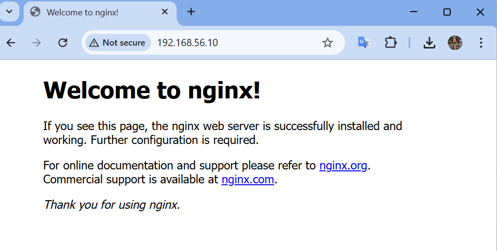
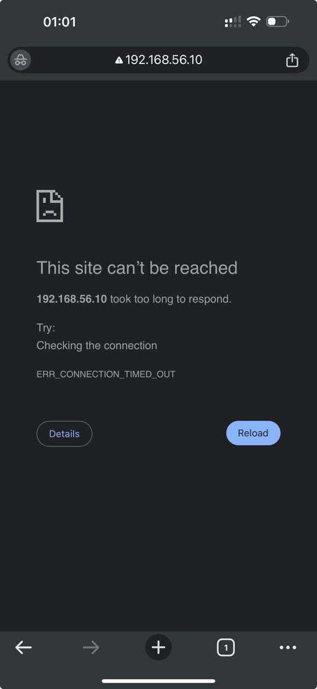
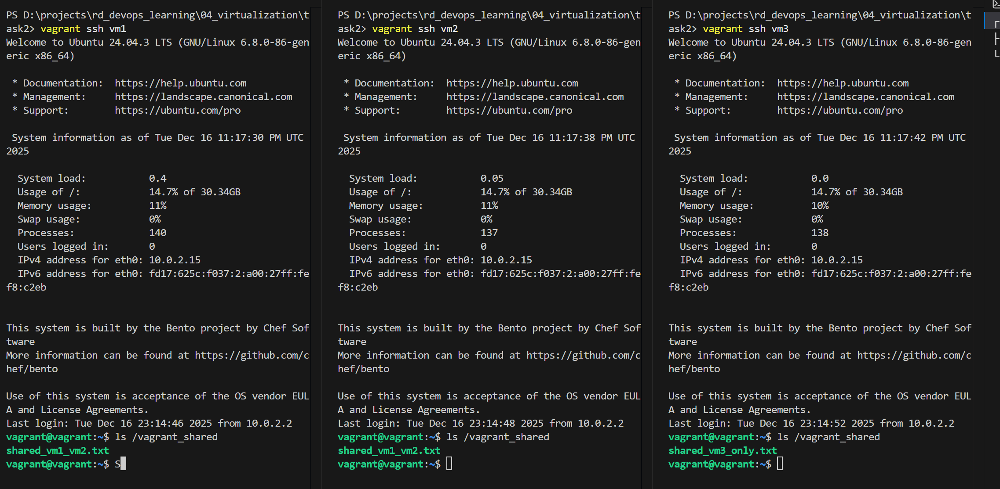

#### [Back to Readme](../Readme.md)

## Task 2: Multi-VM Vagrant Setup

### Requirements
Three VMs with different network configurations:
- **VM1**: Public network (DHCP), nginx web server
- **VM2**: Private network (192.168.56.10), isolated from LAN
- **VM3**: Public network (static IP), accessible from LAN

### Setup

**1. Install Vagrant**
Download from https://developer.hashicorp.com/vagrant/downloads

**2. Create Vagrantfile**
Create [`Vagrantfile`](./Vagrantfile) with VM configurations

**3. Create shared folders**
```bash
mkdir shared
mkdir shared_vm3
```

**4. Start VMs**
```bash
vagrant up
```

### Results

#### VM1 - Public Network (Dynamic IP)
Find the assigned IP:
```bash
vagrant ssh vm1
ip address
```
Accessible from browser at `192.168.0.139` (DHCP-assigned)


#### VM2 - Private Network (192.168.56.10)
Accessible only from host machine, **not** from mobile devices on LAN



Mobile access (blocked):


VM1 can access VM2:


#### VM3 - Public Network (Static IP)
Accessible from LAN at `192.168.0.100`

#### Shared Folders
All VMs have configured shared folders between host and guest



### Cleanup
```bash
vagrant destroy
```
