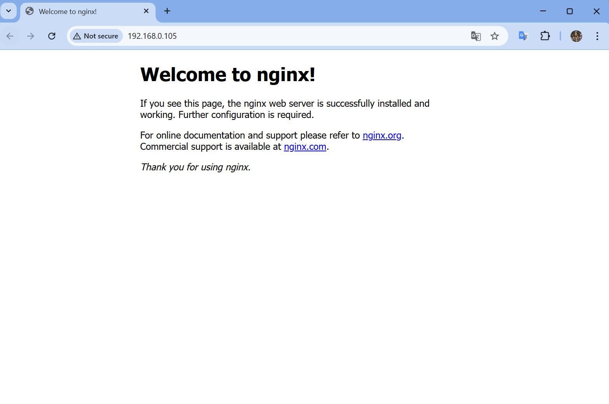
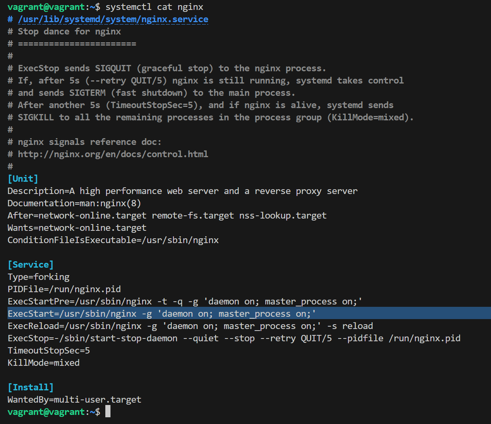
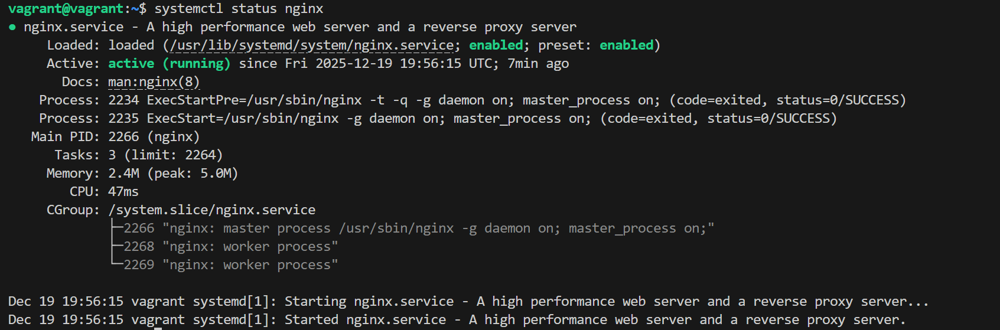
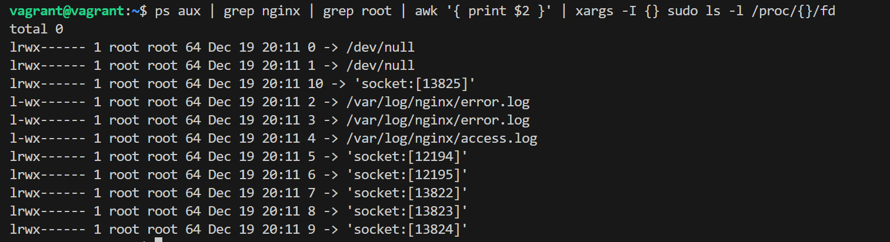
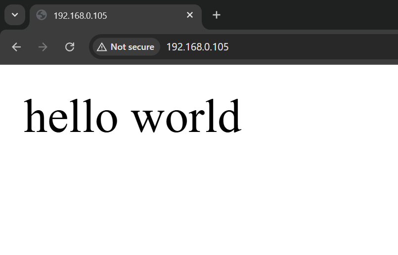

#### [Back to Readme](../Readme.md)

## Task 1: Install Linux with Nginx

### Step 1: Setup Linux with Nginx
- To set up a Linux VM with Nginx, we use Vagrant.
- Create a [Vagrantfile](./Vagrantfile) with the following configuration:
```ruby
Vagrant.configure("2") do |config|
  config.vm.box = "bento/ubuntu-24.04"

  config.vm.define "linux-server" do |vm5|
    vm5.vm.network "public_network", ip: "192.168.0.105"
    
    vm5.vm.provider "virtualbox" do |vb|
      vb.memory = "2048"
      vb.cpus = 2
      vb.name = "vm5"
    end

    vm5.vm.provision "shell", inline: <<-SHELL
      apt-get update
      apt-get install -y nginx
    SHELL
  end
end
```
- In the terminal, run `vagrant up`
- Once complete, open a browser and navigate to the IP address specified in the Vagrantfile: `http://192.168.0.105`


### Step 2: How the Nginx Service is Launched and Managed
- Nginx is managed by **systemd**, the init system used in Linux distributions.
- When Nginx is installed via `apt-get install -y nginx`, it automatically creates a systemd service unit file at `/lib/systemd/system/nginx.service`.
- The service starts automatically after installation and on system boot. Start command is displayed here:

- To check the service status, run:
```bash
sudo systemctl status nginx
```



### Step 3: Nginx File Descriptors
To list all file descriptors, find the process PID and run `ls -l /proc/<yourpid>/fd`:
```bash
ps aux | grep nginx | grep root | awk '{ print $2 }' | xargs -I {} sudo ls -l /proc/{}/fd
```



### Step 4: Read Logs
- To read recent logs, run `tail -f /var/log/nginx/access.log`

### Step 5: Reload Configuration Without Restart
- To change configuration without restarting, run `sudo nginx -s reload`
- To verify this, we'll update the start page:
  - Currently, Nginx is configured to show `/var/www/html/index.nginx-debian.html`
  - Create a new HTML file: `sudo touch /var/www/mypage.html` and add any message
  - Change the config for the default site: `sudo nano /etc/nginx/sites-available/default`
    - Update the root directory to: `root /var/www;`
    - Add the newly created file to the index directive: `index mypage.html`
  - After updating the page, nothing changes yet
  - Run `sudo nginx -t` to check for configuration errors
  - Reload the configuration: `sudo nginx -s reload`
  