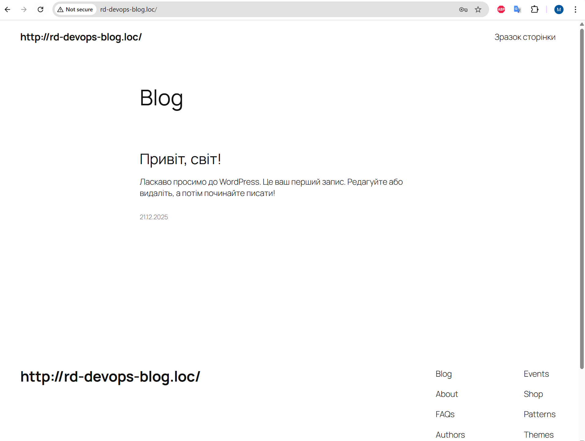

#### [Back to Readme](../Readme.md)

## Task 2: Mount Partition

### Step 1: Create a Logical Volume
- Create a new logical volume named `static-lv` with 5GB size from the volume group `ubuntu-vg`:
```bash
sudo lvcreate -n static-lv -L 5G ubuntu-vg
```

### Step 2: Format the Logical Volume
- Format the newly created logical volume with the ext4 filesystem:
```bash
sudo mkfs.ext4 /dev/ubuntu-vg/static-lv
```

### Step 3: Get the UUID of the Partition
- Retrieve the UUID of the partition:
```bash
sudo blkid /dev/ubuntu-vg/static-lv
```
- Example output: `UUID=f518628d-cf67-4393-b0dc-fd38bb8f02fc`

### Step 4: Create the Mount Point Directory
- Create the directory where the partition will be mounted:
```bash
sudo mkdir -p /var/www/static
```

### Step 5: Configure Automatic Mounting on Boot
- Edit the `/etc/fstab` file to configure automatic mounting:
```bash
sudo nano /etc/fstab
```
- Add the following entry (replace UUID with your actual UUID from Step 3):
```
UUID=f518628d-cf67-4393-b0dc-fd38bb8f02fc  /var/www/static  ext4  defaults,noatime  0  2
```
- **Explanation of fstab options:**
  - `UUID=...`: The unique identifier of the partition
  - `/var/www/static`: The mount point directory
  - `ext4`: The filesystem type
  - `defaults,noatime`: Mount options (defaults + don't update access time for better performance)
  - `0`: Don't dump (backup) this filesystem
  - `2`: Check filesystem on boot (root filesystem uses 1, others use 2)

### Step 6: Mount the Partition
- Mount all filesystems defined in `/etc/fstab`:
```bash
sudo mount -a
```
- Verify the partition is mounted:
```bash
df -h | grep static
```
- This should show the mounted partition with its size and mount point.


### Step 7: Configure Domain Access
- To access the site using domain `rd-devops-blog.loc`, add a record to the Windows hosts file.
- Open Notepad as Administrator and edit `C:\Windows\System32\drivers\etc\hosts`
- Add the following line:
```
192.168.0.105  rd-devops-blog.loc
```
- Save the file. Now you can access the site via the domain name instead of IP address.

### Step 8: Install WordPress

#### 8.1: Install PHP and required extensions
- Install software properties and certificates:
```bash
sudo apt install -y software-properties-common ca-certificates lsb-release apt-transport-https
```
- Install PHP 8.3 with necessary extensions for WordPress:
```bash
sudo apt install -y php8.3-cli php8.3-fpm php8.3-mysql php8.3-curl php8.3-xml php8.3-mbstring php8.3-zip php8.3-gd php8.3-intl php8.3-bcmath
```

#### 8.2: Install and configure MySQL database
- Install MySQL server:
```bash
sudo apt install mysql-server
```
- Create WordPress database and user:
```bash
sudo mysql
```
```sql
CREATE DATABASE wordpress_db;
CREATE USER 'wp_user'@'localhost' IDENTIFIED BY 'your_strong_password';
GRANT ALL PRIVILEGES ON wordpress_db.* TO 'wp_user'@'localhost';
FLUSH PRIVILEGES;
EXIT;
```

#### 8.3: Download and setup WordPress
- Download WordPress and move it to the mounted partition:
```bash
cd /tmp
wget https://wordpress.org/latest.tar.gz
tar -xvzf latest.tar.gz
sudo mv wordpress /var/www/static/rd-devops-blog.loc
sudo chown -R www-data:www-data /var/www/static/rd-devops-blog.loc
sudo chmod -R 755 /var/www/static/rd-devops-blog.loc
```

#### 8.4: Configure Nginx for WordPress
- Create Nginx configuration file:
```bash
sudo nano /etc/nginx/sites-available/rd-devops-blog.loc
```
- Add the following configuration:
```nginx
server {
    listen 80;
    server_name rd-devops-blog.loc;
    root /var/www/static/rd-devops-blog.loc;
    index index.php index.html index.htm;

    location / {
        try_files $uri $uri/ /index.php?$args;
    }

    location ~ \.php$ {
        include snippets/fastcgi-php.conf;
        fastcgi_pass unix:/run/php/php8.3-fpm.sock;
    }

    location ~* \.(js|css|png|jpg|jpeg|gif|ico|svg)$ {
        expires max;
        log_not_found off;
    }
}
```
- Enable the site and restart Nginx:
```bash
sudo ln -s /etc/nginx/sites-available/rd-devops-blog.loc /etc/nginx/sites-enabled/
sudo rm /etc/nginx/sites-enabled/default
sudo nginx -t
sudo systemctl restart nginx
```

#### 8.5: Complete WordPress installation
- Open browser and navigate to `http://rd-devops-blog.loc`
- Follow the WordPress installation wizard to complete the setup.
