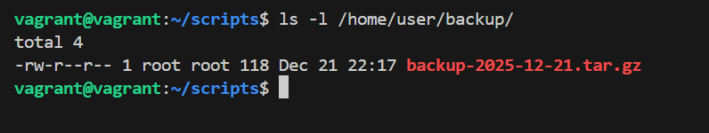
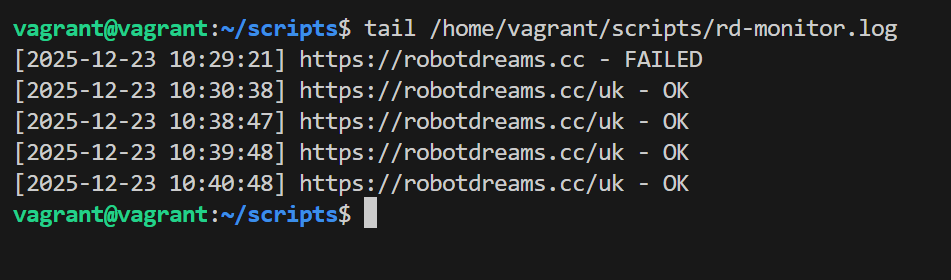

## Bash Scripting Tasks

### Task 1: Automated Backup Script with Cron
Create a simple Bash script for automatic backup of the `/home/user/data` directory to `/home/user/backup` every day. Configure a cron job to execute this script daily at 2:00 AM.

## Step 1: Create the Backup Script
- Create folder scripts and open it: `mkdir -p ~/scripts && cd ~/scripts`
- Create script `nano backup_script.sh` with the following content:
```bash
#!/bin/bash

SOURCE="/home/user/data"
DEST="/home/user/backup/"
FILENAME="backup-$(date +%Y-%m-%d).tar.gz"

tar -czf "$DEST$FILENAME" "$SOURCE"
``` 
- Save the script and make it executable:
`chmod +x ~/scripts/backup_script.sh`

## Step 2: Schedule with Cron
- Open the crontab editor:
`crontab -e`
- Add the following line at the end of the file:
`0 2 * * * /home/user/scripts/backup_script.sh`

This cron expression means:
- `0` - At minute 0
- `2` - At hour 2 (2:00 AM)
- `*` - Every day of the month
- `*` - Every month
- `*` - Every day of the week

## Step 3: Testing
To verify the backup works:
1. You can test the script manually first: `~/scripts/backup_script.sh`
2. Check the log file: `cat /home/user/backup/backup.log`
3. For testing cron, temporarily change the schedule to `* * * * *` to run every minute

4. After testing, change it back to `0 2 * * *` for the daily 2 AM schedule


### Task 2: Systemd Service for Website Monitoring
Create and configure a custom systemd service for automatic startup of a script that checks website availability and writes the result to a log file.

#### Step 1: Create Monitoring Script
- Create script file `/home/vagrant/scripts/rd-monitor.sh` with the following content:
```bash
#!/bin/bash

URL="https://robotdreams.cc/uk"
LOG_FILE="/home/vagrant/scripts/rd-monitor.log"

while true; do
    timestamp=$(date '+%Y-%m-%d %H:%M:%S')
    
    if curl -s -o /dev/null -w "%{http_code}" "$URL" | grep -q "200"; then
        echo "[$timestamp] $URL - OK" >> "$LOG_FILE"
    else
        echo "[$timestamp] $URL - FAILED" >> "$LOG_FILE"
    fi
    
    sleep 60
done
```
This script checks https://robotdreams.cc/uk every 60 seconds and logs the result.

- Give execution rights to script: `chmod +x /home/vagrant/scripts/rd-monitor.sh`
- Run and wait for a few seconds, then check if log file is created and logs are written.

#### Step 2: Create Systemd Service File
 - Create new service: `sudo nano /etc/systemd/system/rd-monitor.service`
 - Add the following service configuration:
 ```
[Unit]
Description=monitor service
After=network.target
StartLimitIntervalSec=0

[Service]
Type=simple
Restart=always
RestartSec=1
User=vagrant
ExecStart=/home/vagrant/scripts/rd-monitor.sh

[Install]
WantedBy=multi-user.target
 ```

 Run commands:
 - Start service: `sudo systemctl start rd-monitor`
 - Check status: `sudo systemctl status rd-monitor`
 - Enable on boot: `sudo systemctl enable rd-monitor`
 - Check logs: `tail -f /home/vagrant/scripts/rd-monitor.log`
 


*If something goes wrong, check: `journalctl -u rd-monitor.service`

### Task 3: System Resource Monitoring Script
Write a script to monitor system resource usage and save the results to a file.

#### Step 1: Create System Monitoring Script
- Create script file `/home/vagrant/scripts/`[system-monitor.sh](./system-monitor.sh).
- Give execution rights to script: `chmod +x /home/vagrant/scripts/system-monitor.sh`
- Test the script: `/home/vagrant/scripts/system-monitor.sh &`
- Check logs: `tail -f /home/vagrant/scripts/system-monitor.log`

#### Step 2: Create Systemd Service (Optional)
- Create new service: `sudo nano /etc/systemd/system/system-monitor.service`
- Add the following service configuration:
```
[Unit]
Description=System Resource Monitoring Service
After=network.target

[Service]
Type=simple
Restart=always
RestartSec=1
User=vagrant
ExecStart=/home/vagrant/scripts/system-monitor.sh

[Install]
WantedBy=multi-user.target
```

Run commands:
- Reload systemd: `sudo systemctl daemon-reload`
- Start service: `sudo systemctl start system-monitor`
- Check status: `sudo systemctl status system-monitor`
- Enable on boot: `sudo systemctl enable system-monitor`
- Check logs: `tail -f /home/vagrant/scripts/system-monitor.log`

Example log output:
```
[2025-12-23 11:08:50] CPU: 3.8% | Memory: 14.95% (294MB/1967MB) | Disk: 16%
[2025-12-23 11:09:43] CPU: 0.0% | Memory: 15.20% (299MB/1967MB) | Disk: 16%
[2025-12-23 11:09:51] CPU: 8.7% | Memory: 15.25% (300MB/1967MB) | Disk: 16%
```

### Task 4: Nginx Access Log Rotation
Configure rotation for the Nginx access log file.

#### Step 1: Install Nginx (if not already installed)
```bash
sudo apt update
sudo apt install nginx -y
```

#### Step 2: Create Logrotate Configuration
- Create a custom logrotate configuration: `sudo nano /etc/logrotate.d/nginx-custom`
- Add the following configuration:
```
/var/log/nginx/access.log {
    daily
    rotate 7
    missingok
    notifempty
    compress
    delaycompress
    sharedscripts
    postrotate
        if [ -f /var/run/nginx.pid ]; then
            kill -USR1 $(cat /var/run/nginx.pid)
        fi
    endscript
}
```


#### Step 3: Test Logrotate Configuration
- Check configuration syntax: `sudo logrotate -d /etc/logrotate.d/nginx-custom`
- Force rotation for testing: `sudo logrotate -f /etc/logrotate.d/nginx-custom`
- Verify rotated files: `ls -lh /var/log/nginx/`

You should see files like:
```
access.log
access.log.1
access.log.2.gz
access.log.3.gz
```

#### Step 4: Verify Automatic Rotation
Logrotate runs daily via cron (usually at `/etc/cron.daily/logrotate`). To verify:
- Check cron job: `cat /etc/cron.daily/logrotate`
- Monitor logs over time: `ls -lh /var/log/nginx/`
- Check logrotate status: `sudo cat /var/lib/logrotate/status | grep nginx`