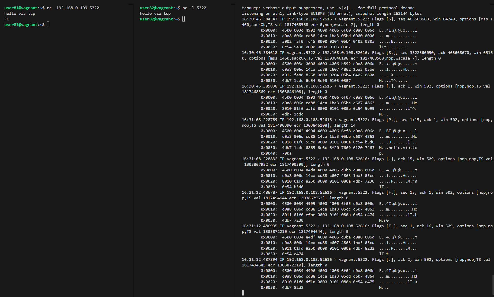
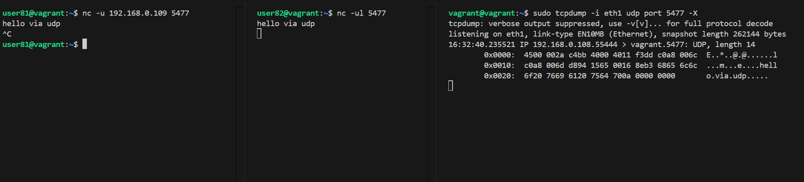
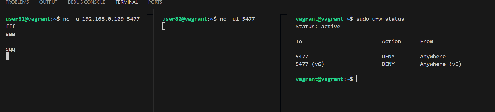
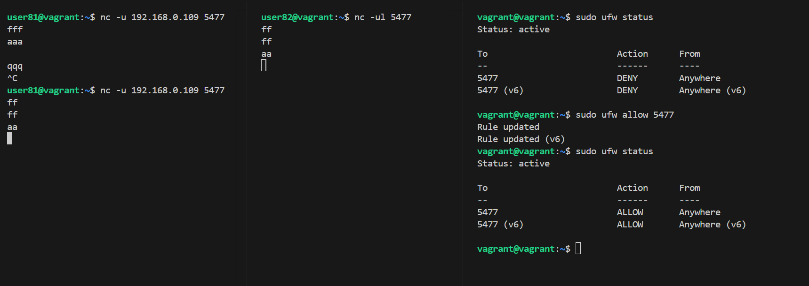

#### [Back to Readme](../Readme.md)

## Task 1: Creating Network Connections Using Netcat

### Objective
Using netcat (nc), establish connections between two machines in a local network via TCP and UDP protocols. Send text messages between the machines and analyze the differences in TCP and UDP behavior. Additionally, block ports with a firewall and observe how this affects each protocol.

### Environment Setup
- **VM1 (Client)**: vm81 - 192.168.0.108
- **VM2 (Server)**: vm82 - 192.168.0.109
- **Tools**: netcat (nc), tcpdump, ufw

---

## Step 1: TCP Connection

### Setup TCP Server and Client

**On VM82 (Server):**
```bash
nc -l 5322
```
- `-l`: Listen mode for incoming connections
- `5322`: Port number to listen on

**On VM81 (Client):**
```bash
nc 192.168.0.109 5322
```
- `192.168.0.109`: IP address of the server (VM82)
- `5322`: Port number to connect to

### Monitoring TCP Traffic

**On VM82 (in a separate terminal):**
```bash
sudo tcpdump -i eth1 tcp port 5322 -X
```
- `-i eth1`: Listen on eth1 network interface
- `tcp port 5322`: Filter for TCP traffic on port 5322
- `-X`: Display packet data in hex and ASCII format

### Result


---

## Step 2: UDP Connection

### Setup UDP Server and Client

**On VM82 (Server):**
```bash
nc -ul 5477
```
- `-u`: Use UDP protocol instead of TCP
- `-l`: Listen mode for incoming connections
- `5477`: Port number to listen on

**On VM81 (Client):**
```bash
nc -u 192.168.0.109 5477
```
- `-u`: Use UDP protocol
- `192.168.0.109`: IP address of the server
- `5477`: Port number to connect to

### Monitoring UDP Traffic

**On VM82 (in a separate terminal):**
```bash
sudo tcpdump -i eth1 udp port 5477 -X
```
- `udp port 5477`: Filter for UDP traffic on port 5477

### Result


---

## Observed Differences Between TCP and UDP

### TCP Observed Behavior:
- Connection establishment creates SYN and SYN-ACK packets
- Each data transmission receives an acknowledgment (ACK)
- When the client closes the connection, both sides exchange FIN and ACK packets
- Connection state is maintained throughout the session

### UDP Observed Behavior:
- No handshake or connection establishment messages
- Data is sent directly without acknowledgment
- When the client closes the connection, the server is not notified
- No connection state tracking

---

## Step 3: Firewall Port Blocking

### Blocking a Port with UFW

**On VM82 (Server):**
```bash
sudo ufw deny 5477
```
- Blocks incoming and outgoing traffic on UDP port 5477



### Observed Effects

- The client connection **appears** to establish successfully (no error message)
- Messages sent from the client are **not received** by the server
- **No error indication** is provided to the client

### Re-enabling the Port

**On VM82 (Server):**
```bash
sudo ufw allow 5477
```

