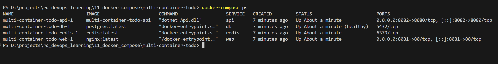
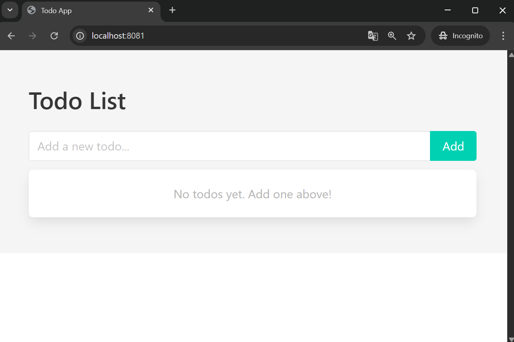
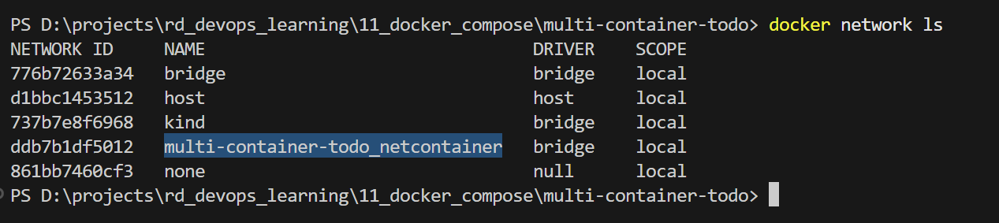
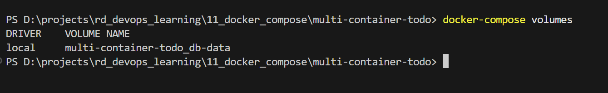
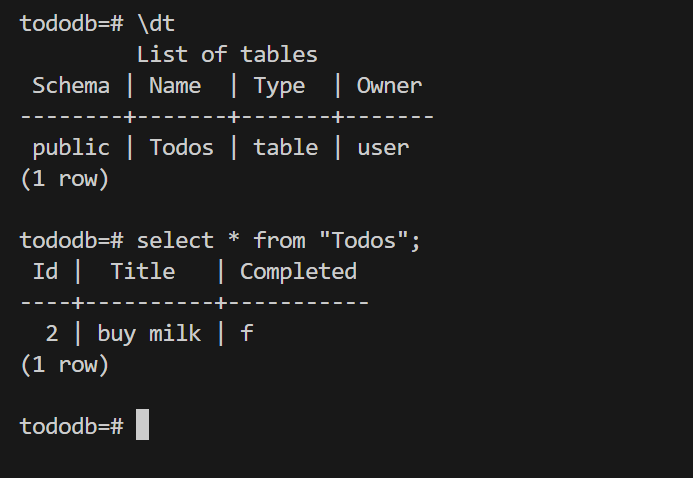

# Docker Compose - "Todo Application with Docker Compose"

### Project structure
- **Web**: Nginx serving static frontend (port 8081)
- **API**: .NET backend application (port 8082)
- **Database**: PostgreSQL for data persistence
- **Cache**: Redis for caching

### Setup and Deployment

**1. Docker Installation**
Installed Docker Desktop for Windows from [docker.com](https://www.docker.com/)

**2. Create docker-compose.yml**
Created [`docker-compose.yaml`](./multi-container-todo/docker-compose.yaml) defining all services:
- Web service with nginx
- API service built from Dockerfile
- PostgreSQL database with health check
- Redis cache
- Shared network `netcontainer`
- Persistent volume `db-data` for PostgreSQL

**3. Start the Application**
```bash
cd multi-container-todo
docker-compose up -d
```

**4. Verify Running Services**
```bash
docker-compose ps
```



**5. Test the Application**
Access the web interface at http://localhost:8081



### Network and Volumes

**View Networks**
```bash
docker network ls
```



**View Volumes**
```bash
docker-compose volumes
```



**Database Connection Test**
```bash
docker exec -it <db_container_id> psql -U user -d tododb
```



### Scaling Services

**Scale Api Service**
```bash
docker-compose up -d --scale api=3
```


*Screenshot showing 3 instances of web service running*

### Cleanup
```bash
docker-compose down -v
```