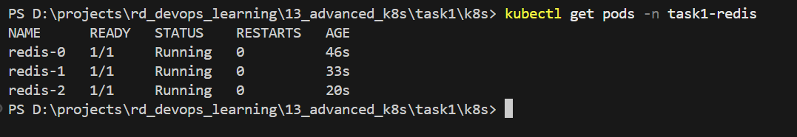
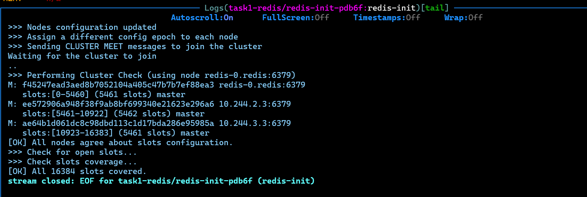
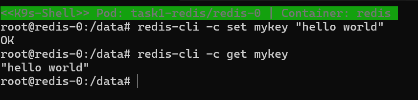
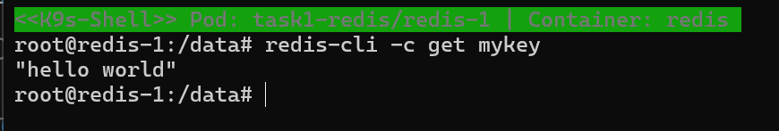
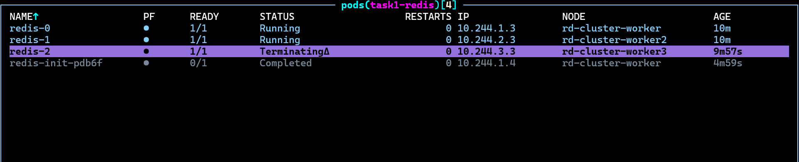
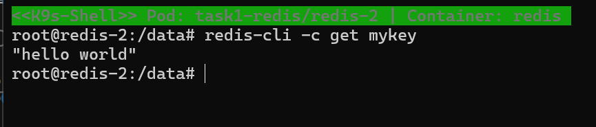

#### [Back to Readme](../Readme.md)


## Task 1: Redis StatefulSet Cluster

### Prerequisites
- Kind installed and configured

### Step 1: Setup namespace and redis cluster

```powershell
cd ./k8s
kubectl apply -f .\namespace.yml -f .\redis-statefull-set.yaml
```



When all pods are created run job to configure redis cluster

```powershell
cd ./k8s
kubectl apply -f redis-init-job.yml
```


### Step 2: Test Redis Cluster Data Persistence

Set key to redis-0 pod

```powershell
kubectl exec -it redis-0 -n redis -- redis-cli -c SET mykey "hello world"
```



Get `mykey` from redis-1 to verify cluster replication

```powershell
kubectl exec -it redis-1 -n redis -- redis-cli -c GET mykey
```



Terminate pod redis-2 to test persistence

```powershell
kubectl delete pod redis-2 -n redis
```


Get key after re-create of the pod to verify StatefulSet persistence

```powershell
kubectl exec -it redis-2 -n redis -- redis-cli -c GET mykey
```

