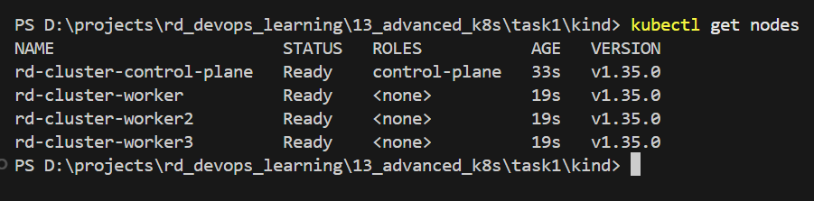
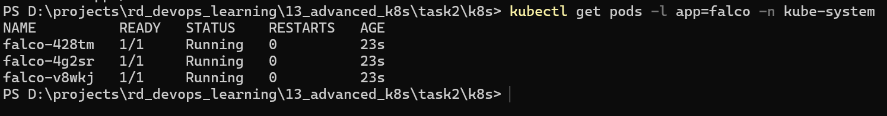
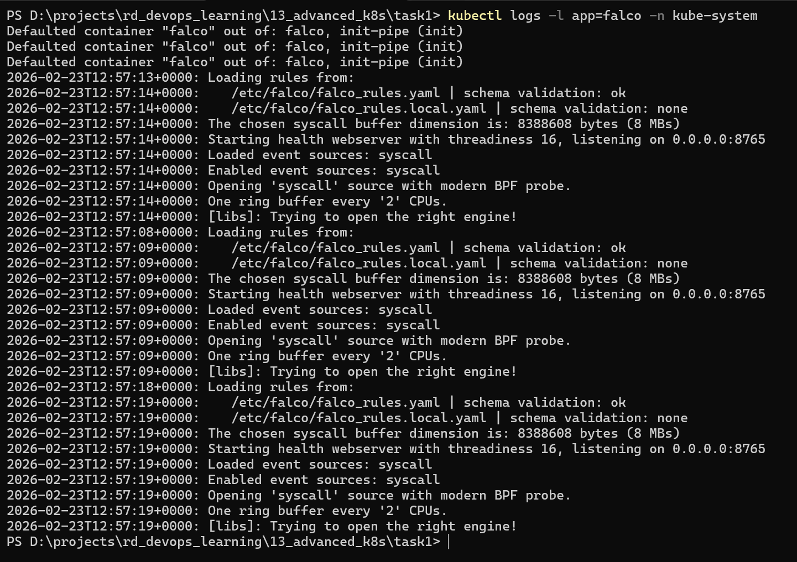

#### [Back to Readme](../Readme.md)


## Task 2: Falco Security Monitoring with DaemonSet

### Prerequisites
- Kind installed and configured
- kubectl configured to access the cluster

### Step 0: Create Kind Cluster

Create a new Kind cluster for this task:

```powershell
./kind/CreateKindCluster.ps1

kubectl get nodes
```



### Step 1: Deploy Falco DaemonSet

Apply the Falco DaemonSet configuration:

```powershell
cd ./k8s
kubectl apply -f .\falco-account.yaml
kubectl apply -f .\falco-daemonset.yaml
```

### Step 2: Verify Falco Deployment

Check that Falco pods are running on each node:

```powershell
kubectl get pods -l app=falco -n kube-system
```


### Step 3: Check Falco Logs

View logs from Falco pods to verify they are generating security events:

```powershell
kubectl logs -l app=falco -n kube-system
```



### Step 4: Monitor Falco Events in Real-Time

To follow Falco logs in real-time:

```powershell
kubectl logs -l app=falco -n kube-system -f
```

### Step 5: Trigger Falco Security Events

Falco outputs security events to **stderr** by default. To see events, monitor Falco logs while performing actions that trigger Falco's default rules.

**Important**: Open a terminal and start monitoring Falco logs first:

```powershell
# Terminal 1: Monitor Falco logs (watch stderr)
kubectl logs -l app=falco -n kube-system -f 2>&1 | Select-String -Pattern "Notice|Warning|Error|Critical"
```

Or view all logs including events:

```powershell
# Terminal 1: Monitor all Falco output
kubectl logs -l app=falco -n kube-system -f
```

Then in **Terminal 2**, run these commands that will trigger Falco alerts:

#### Action 1: Shell Spawned in Container (Most Reliable)

This will trigger Falco's "Shell spawned in container" rule:

```powershell
kubectl run shell-test --image=busybox --restart=Never --rm -it -- sh
# Once inside the container, type: exit
```

Or non-interactive:

```powershell
kubectl run shell-test --image=busybox --restart=Never --rm -- sh -c "sh -c 'echo test'"
```

#### Action 2: Write to Sensitive Directory

Write to `/etc` or `/usr` directories (triggers "Write below binary dir" rule):

```powershell
kubectl run write-test --image=busybox --restart=Never --rm -- sh -c "touch /etc/test.txt"
```

#### Action 3: Access Sensitive Files

Read sensitive files (triggers "Read sensitive file untrusted" rule):

```powershell
kubectl run read-test --image=busybox --restart=Never --rm -- sh -c "cat /etc/shadow 2>/dev/null || cat /etc/passwd"
```

#### Action 4: Create Privileged Pod

Create a privileged container (triggers "Launch privileged container" rule):

```powershell
kubectl run privileged-test --image=busybox --restart=Never --privileged --rm -- sh -c "whoami"
```

#### Action 5: Unexpected Network Activity

Make outbound connections (may trigger network rules):

```powershell
kubectl run network-test --image=busybox --restart=Never --rm -- sh -c "nc -zv google.com 80 2>&1 || wget -O- http://google.com 2>&1 | head -1"
```

#### Action 6: Write to Root Filesystem

Write to root filesystem (triggers "Write below root" rule):

```powershell
kubectl run root-write-test --image=busybox --restart=Never --rm -- sh -c "touch /test.txt && ls -la /test.txt"
```

#### Action 7: Spawn Process from Sensitive Binary

Execute binaries from sensitive locations:

```powershell
kubectl run binary-test --image=busybox --restart=Never --rm -- sh -c "/bin/sh -c 'ps aux'"
```

#### Viewing Events

```
13:36:45.123456789: Notice A shell was spawned in a container (user=root user_loginuid=-1 container_id=abc123 container_name=k8s_shell-test image=busybox:latest)
13:36:46.234567890: Warning File below /etc opened for writing (user=root file=/etc/test.txt)
13:36:47.345678901: Notice Launch privileged container (user=root container_id=def456 image=busybox:latest)
```

### Configuration Details

The Falco DaemonSet is configured with:

1. **Privileged Access**: Required for Falco to monitor system calls and kernel events
2. **Host Network and PID**: Allows Falco to access host-level system information
3. **Mounted Directories**:
   - `/proc` - Process information
   - `/boot` - Kernel configuration data
   - `/lib/modules` - Kernel modules for eBPF support
   - `/var/run/docker.sock` - Docker socket for container event monitoring
   - `/usr` - System libraries and utilities
   - `/etc` - System configuration files
   - `/dev` - Device files
   - `/sys` - System filesystem for kernel tracepoints
   - `/sys/kernel/debug` - Kernel debugging and tracepoint information

4. **Resource Limits**:
   - CPU: 100m (request and limit)
   - Memory: 128Mi request, 256Mi limit

### Cleanup

To remove Falco from the cluster:

```powershell
cd ./k8s
kubectl delete -f .\falco-daemonset.yaml
```

To delete the entire Kind cluster:

```powershell
./kind/DeleteKindCluster.ps1
```
