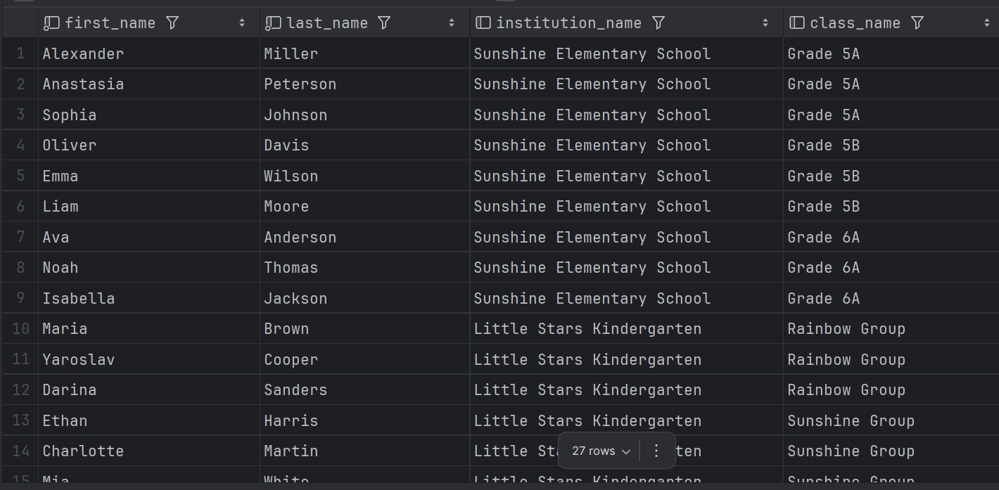
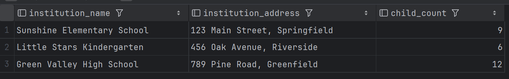
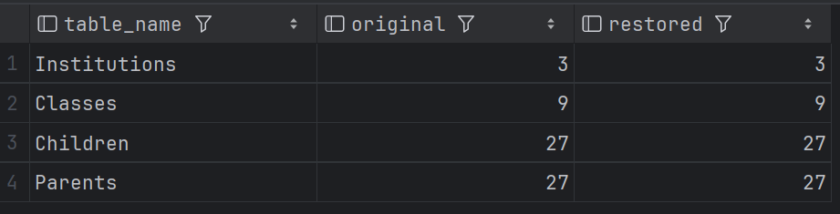
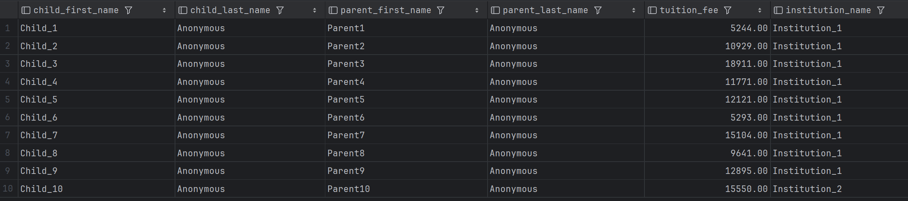

# SQL Database Management

## Task 1: Creating a Database for Schools and Kindergartens

### Step 0: Spin Up Database
For this task, we use MySQL running in Docker. To start the MySQL database locally, use the provided `docker-compose.yaml` file:

```bash
docker-compose up -d
```

### Step 1: Apply Database Schema

Connect to the MySQL container and run the `script.sql` file to create the database schema and populate it with initial data:

```bash
docker-compose exec -it db mysql -u root -pP@ssw0rd123 SchoolDB < script.sql
``` 

### Step 2: Query Children with Their Institutions and Classes

Retrieve a list of all children along with their respective institution and class information, ordered by institution and class:

```sql
select ch.first_name, ch.last_name, i.institution_name, c.class_name
from Children as ch
join Institutions as i on i.institution_id = ch.institution_id
join Classes as c on c.class_id = ch.class_id
order by ch.institution_id, ch.class_id
```


### Step 3: Query Parent-Child Relationships with Tuition Fees

Retrieve parent and child information along with the associated tuition fees:

```sql
select
    p.first_name as parent_first_name,
    p.last_name as parent_last_name,
    ch.first_name as child_first_name,
    ch.last_name as child_last_name,
    p.tuition_fee
from Parents as p
join Children as ch on ch.child_id = p.child_id
order by ch.institution_id
```


### Step 4: Query Institution Summary with Child Count

Get a summary of all institutions with their addresses and the total number of enrolled children:

```sql
select
    MAX(i.institution_name) as institution_name,
    MAX(i.address) as institution_address,
    count(ch.institution_id) as child_count
from Institutions as i
left join Children as ch on ch.institution_id = i.institution_id
group by i.institution_id;

```


### Step 5: Database Backup and Restore

Demonstrate database backup procedures and restore to a new database, then verify data integrity.

#### Create Backup

Export the SchoolDB database using `mysqldump`. The `--set-gtid-purged=OFF` flag prevents GTID conflicts during restore:
```bash
docker-compose exec db mysqldump -u root -pP@ssw0rd123 --set-gtid-purged=OFF SchoolDB > backup.sql
```

#### Restore to New Database

Create a new database and restore the backup:

```powershell
# Create new database
docker-compose exec -T db mysql -u root -pP@ssw0rd123 -e "CREATE DATABASE SchoolDbRestored;"

# Restore backup (PowerShell)
Get-Content backup.sql | docker-compose exec -T db mysql -u root -pP@ssw0rd123 SchoolDbRestored
```

#### Verify Data Integrity

Compare row counts between the original and restored databases to ensure all data was transferred correctly:
```sql
SELECT 'Institutions' as table_name,
    (SELECT COUNT(*) FROM SchoolDB.Institutions) as original,
    (SELECT COUNT(*) FROM SchoolDbRestored.Institutions) as restored
UNION ALL
SELECT 'Classes',
    (SELECT COUNT(*) FROM SchoolDB.Classes),
    (SELECT COUNT(*) FROM SchoolDbRestored.Classes)
UNION ALL
SELECT 'Children',
    (SELECT COUNT(*) FROM SchoolDB.Children),
    (SELECT COUNT(*) FROM SchoolDbRestored.Children)
UNION ALL
SELECT 'Parents',
    (SELECT COUNT(*) FROM SchoolDB.Parents),
    (SELECT COUNT(*) FROM SchoolDbRestored.Parents);

```


## Additional Task: Data Anonymization

### Step 0: Set Up Database
Restore the database for the data anonymization example:

```powershell
# Create new database
docker-compose exec -T db mysql -u root -pP@ssw0rd123 -e "CREATE DATABASE SchoolDbDev;"

# Restore backup (PowerShell)
Get-Content backup.sql | docker-compose exec -T db mysql -u root -pP@ssw0rd123 SchoolDbDev
```

### Step 1: Anonymize Data

Anonymize sensitive information in the development database:

```sql
USE SchoolDbDev;

START TRANSACTION;

UPDATE Institutions
SET
    institution_name = CONCAT('Institution_', institution_id);

UPDATE Children
SET
    first_name = CONCAT('Child_', child_id),
    last_name  = 'Anonymous';

UPDATE Parents
SET
    first_name = CONCAT('Parent', parent_id),
    last_name  = 'Anonymous',
    tuition_fee = FLOOR(5000 + RAND() * (20000 - 5000));
COMMIT;
```

### Step 2: Verify Anonymization

Check the anonymized data to ensure the transformation was successful:
```sql
SELECT
    c.first_name AS child_first_name,
    c.last_name AS child_last_name,
    p.first_name AS parent_first_name,
    p.last_name  AS parent_last_name,
    p.tuition_fee,
    i.institution_name
FROM Parents p
JOIN Children c ON p.child_id = c.child_id
JOIN Institutions i ON i.institution_id = c.institution_id
LIMIT 10;
```
