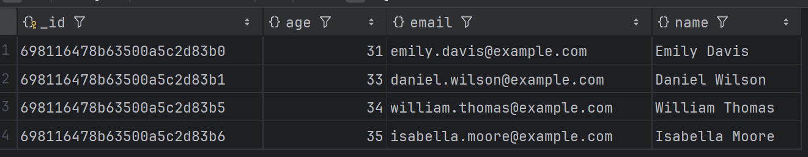
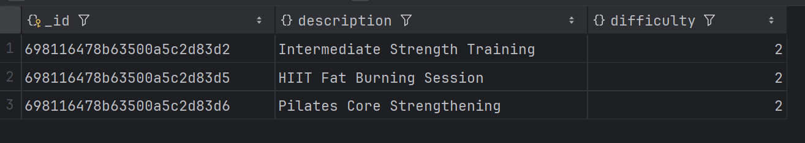
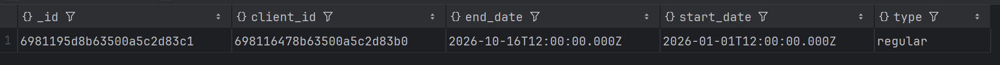

# NoSQL

## Task: Work with MongoDB

### Step 0: Setup db
To setup run `docker-compose up -d` and to connect cli run new temp image:
`docker run -it --network 15_no_sql_default --rm mongo mongosh --host mongo --authenticationDatabase "admin" -u "root" -p`

### Step 1: 
```
use gymDatabase;
db.createCollection('clients');
db.createCollection('memberships');
db.createCollection('workouts');
db.createCollection('trainers');
```


### Step 2: Setup schema validation

Clients schema
```
db.runCommand({
  collMod: "clients",
  validator: {
    $jsonSchema: {
      bsonType: "object",
      required: ["name", "age", "email"],
      properties: {
        name: {
          bsonType: "string",
          description: "Name must be a string.",
        },
        age: {
          bsonType: "int",
          minimum: 10,
          description: "Age must be an integer greater than or equal to 10.",
        },
        email: {
          bsonType: "string",
          pattern: "^\\w+([\\.-]?\\w+)*@\\w+([\\.-]?\\w+)*(\\.\\w{2,3})+$",
          description: "must be a valid email address and is required"
        }
      },
    },
  },
});
```

Memberships schema
```
db.runCommand({
  collMod: "memberships",
  validator: {
    $jsonSchema: {
      bsonType: "object",
      required: ["client_id", "start_date", "end_date", "type"],
      properties: {
        client_id: {
          bsonType: "objectId",
          description: "Client id must be an ObjectId and is required"
        },
        start_date: {
          bsonType: "date",
          description: "Start date must be a date.",
        },
        end_date: {
          bsonType: "date",
          description: "End date must be a date.",
        },
        type: {
          bsonType: "string",
          description: "Type must be a string.",
        },
      },
    },
  },
});
```

Workouts schema
```
db.runCommand({
  collMod: "workouts",
  validator: {
    $jsonSchema: {
      bsonType: "object",
      required: ["description", "difficulty"],
      properties: {
        description: {
          bsonType: "string",
          description: "Description must be a string.",
        },
        difficulty: {
          bsonType: "int",
          description: "Difficulty must be an integer.",
        },
      },
    },
  },
});
```

Trainers schema
```
db.runCommand({
  collMod: "trainers",
  validator: {
    $jsonSchema: {
      bsonType: "object",
      required: ["name", "specialization"],
      properties: {
        name: {
          bsonType: "string",
          description: "Name must be a string.",
        },
        specialization: {
          bsonType: "string",
          description: "Specialization must be a string.",
        }
      },
    },
  },
});
```

### Step 3: Populating collections with data

Insert clients
```
db.clients.insertMany([
    { _id: ObjectId('698116478b63500a5c2d83ad'), name: "John Smith", age: 25, email: "john.smith@example.com" },
    { _id: ObjectId('698116478b63500a5c2d83ae'), name: "Anna Brown", age: 27, email: "anna.brown@example.com" },
    { _id: ObjectId('698116478b63500a5c2d83af'), name: "Michael Johnson", age: 29, email: "michael.johnson@example.com" },
    { _id: ObjectId('698116478b63500a5c2d83b0'), name: "Emily Davis", age: 31, email: "emily.davis@example.com" },
    { _id: ObjectId('698116478b63500a5c2d83b1'), name: "Daniel Wilson", age: 33, email: "daniel.wilson@example.com" },
    { _id: ObjectId('698116478b63500a5c2d83b2'), name: "Sophia Miller", age: 26, email: "sophia.miller@example.com" },
    { _id: ObjectId('698116478b63500a5c2d83b3'), name: "James Anderson", age: 28, email: "james.anderson@example.com" },
    { _id: ObjectId('698116478b63500a5c2d83b4'), name: "Olivia Taylor", age: 30, email: "olivia.taylor@example.com" },
    { _id: ObjectId('698116478b63500a5c2d83b5'), name: "William Thomas", age: 34, email: "william.thomas@example.com" },
    { _id: ObjectId('698116478b63500a5c2d83b6'), name: "Isabella Moore", age: 35, email: "isabella.moore@example.com" }
]);
```

Insert memberships

```
db.memberships.insertMany([
    { client_id: ObjectId('698116478b63500a5c2d83ad'), start_date: new Date("2026-01-01T12:00:00Z"), end_date: new Date("2026-01-31T12:00:00Z"), type: "regular" },
    { client_id: ObjectId('698116478b63500a5c2d83ae'), start_date: new Date("2026-01-01T12:00:00Z"), end_date: new Date("2026-02-02T12:00:00Z"), type: "gold" },
    { client_id: ObjectId('698116478b63500a5c2d83af'), start_date: new Date("2026-01-01T12:00:00Z"), end_date: new Date("2026-01-11T12:00:00Z"), type: "premium" },
    { client_id: ObjectId('698116478b63500a5c2d83b0'), start_date: new Date("2026-01-01T12:00:00Z"), end_date: new Date("2026-10-16T12:00:00Z"), type: "regular" }
]);
```

Insert trainers
```
db.trainers.insertMany([
    { _id: ObjectId('698116478b63500a5c2d83c1'), name: "Sarah Connor", specialization: "Strength Training" },
    { _id: ObjectId('698116478b63500a5c2d83c2'), name: "Mike Ross", specialization: "Cardio" },
    { _id: ObjectId('698116478b63500a5c2d83c3'), name: "Jessica Jones", specialization: "Yoga" },
    { _id: ObjectId('698116478b63500a5c2d83c4'), name: "Bruce Wayne", specialization: "CrossFit" },
    { _id: ObjectId('698116478b63500a5c2d83c5'), name: "Diana Prince", specialization: "Pilates" }
]);
```

Insert workouts
```
db.workouts.insertMany([
    { _id: ObjectId('698116478b63500a5c2d83d1'), description: "Beginner Cardio Routine", difficulty: 1 },
    { _id: ObjectId('698116478b63500a5c2d83d2'), description: "Intermediate Strength Training", difficulty: 2 },
    { _id: ObjectId('698116478b63500a5c2d83d3'), description: "Advanced CrossFit WOD", difficulty: 3 },
    { _id: ObjectId('698116478b63500a5c2d83d4'), description: "Yoga Flow for Flexibility", difficulty: 1 },
    { _id: ObjectId('698116478b63500a5c2d83d5'), description: "HIIT Fat Burning Session", difficulty: 2 },
    { _id: ObjectId('698116478b63500a5c2d83d6'), description: "Pilates Core Strengthening", difficulty: 2 },
    { _id: ObjectId('698116478b63500a5c2d83d7'), description: "Power Lifting Basics", difficulty: 3 }
]);
```

### Step 4: Queries

Find all clients over 30 years old
```
db.clients.find({ age: { $gt: 30 }})
```


List workouts with medium difficulty
```
db.workouts.find({ difficulty: 2})
```


Show membership information for a client with a specific client_id
```
db.memberships.findOne({ client_id: ObjectId('698116478b63500a5c2d83b0') });
```
