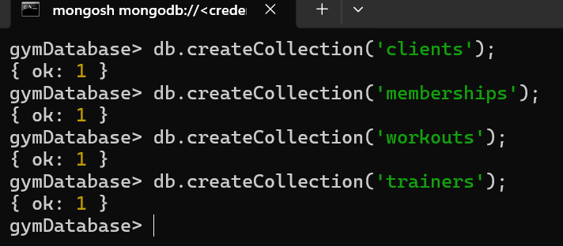

# NoSQL

## Task: Work with MongoDB

### Step 0: Setup db
To setup run `docker-compose up -d` and to connect cli run new temp image:
`docker run -it --network 15_no_sql_default --rm mongo mongosh --host mongo --authenticationDatabase "admin" -u "root" -p`

### Step 1: 
```
use gymDatabase;
db.createCollection('clients');
db.createCollection('memberships');
db.createCollection('workouts');
db.createCollection('trainers');
```



### Step 2: Setup schema validation

Clients schema
```
db.runCommand({
  collMod: "clients",
  validator: {
    $jsonSchema: {
      bsonType: "object",
      required: ["name", "age", "email"],
      properties: {
        client_id: {
          bsonType: "objectId",
          description: "Must be an ObjectId"
        },
        name: {
          bsonType: "string",
          description: "Name must be a string.",
        },
        age: {
          bsonType: "int",
          minimum: 10,
          description: "Age must be an integers greater than or equal to 10.",
        },
        email: {
          bsonType: "string",
          pattern: "^\\w+([\\.-]?\\w+)*@\\w+([\\.-]?\\w+)*(\\.\\w{2,3})+$",
          description: "must be a valid email address and is required"
        }
      },
    },
  },
});
```

Memberships schema
```
db.runCommand({
  collMod: "memberships",
  validator: {
    $jsonSchema: {
      bsonType: "object",
      required: ["membership_id", "client_id", "start_date", "end_date", "type"],
      properties: {
        membership_id: {
          bsonType: "objectId",
          description: "Membership id must be an ObjectId and is required"
        },
        client_id: {
          bsonType: "objectId",
          description: "Client id must be an ObjectId and is required"
        },
        start_date: {
          bsonType: "date",
          description: "Start date must be a date.",
        },
        end_date: {
          bsonType: "date",
          description: "End date must be a date.",
        },
        type: {
          bsonType: "string",
          description: "Type must be a string.",
        },
      },
    },
  },
});
```

Workouts schema
```
db.runCommand({
  collMod: "workouts",
  validator: {
    $jsonSchema: {
      bsonType: "object",
      required: ["workout_id", "description", "difficulty"],
      properties: {
        workout_id: {
          bsonType: "objectId",
          description: "Membership id must be an ObjectId and is required"
        },
        description: {
          bsonType: "string",
          description: "Description must be a string.",
        },
        difficulty: {
          bsonType: "int",
          description: "Difficulty must be a integer.",
        },
      },
    },
  },
});
```

Trainers schema
```
db.runCommand({
  collMod: "trainers",
  validator: {
    $jsonSchema: {
      bsonType: "object",
      required: ["trainer_id", "name", "specialization"],
      properties: {
        trainer_id: {
          bsonType: "objectId",
          description: "Trainer id must be an ObjectId and is required"
        },
        name: {
          bsonType: "string",
          description: "Name must be a string.",
        },
        specialization: {
          bsonType: "string",
          description: "Specialization must be a string.",
        }
      },
    },
  },
});
```

### Step 3: Populating collections with data
Add several records to each collection

### Step 4: Queries
  * Find all clients over 30 years old
  * List workouts with medium difficulty
  * Show membership information for a client with a specific client_id