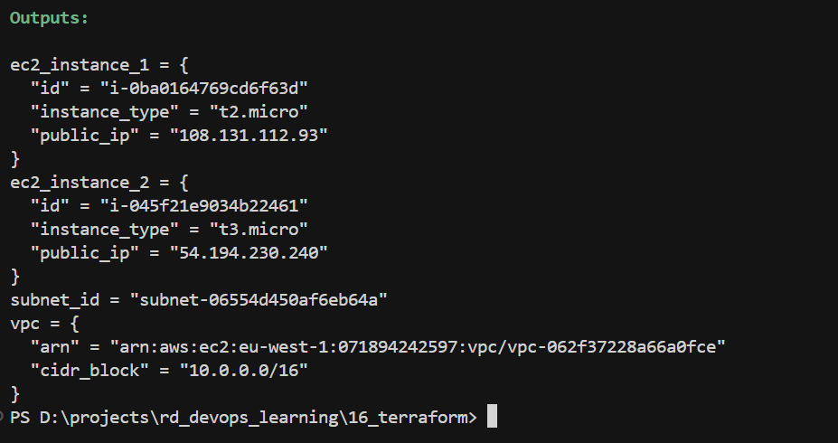

# Terraform — VPC and EC2 with Modules

Terraform config that creates a VPC, subnet(s), and EC2 instances using reusable modules.

## Prerequisites

- [Terraform](https://www.terraform.io/downloads) installed
- AWS credentials configured (e.g. `AWS_ACCESS_KEY_ID`, `AWS_SECRET_ACCESS_KEY`, or `aws configure`)
- SSH key pair in `16_terraform/.keys/`:
  - `mi-rd-ec2-key.pub` (public key; used by `aws_key_pair`)

## Structure

```
16_terraform/
├── main.tf          # Root config: provider, VPC, subnet, key pair, EC2 instances
├── variables.tf     # Root variables (region)
├── output.tf        # Root outputs (VPC summary)
└── modules/
    ├── rd_vpc/      # VPC (cidr_block, tags)
    ├── rd_subnet/   # Subnet (vpc_id, cidr_block, tags)
    └── rd_ec2/      # EC2 instance (Amazon Linux 2, instance_type, subnet_id, key, tags)
```

## Usage

```bash
cd 16_terraform
terraform init
terraform plan
terraform apply
```

After apply, run `terraform output` to see:

| Output | Contents |
|---|---|
| `vpc` | VPC ARN and CIDR block |
| `subnet_id` | Subnet ID |
| `ec2_instance_1` | Instance 1 — ID, public IP, type |
| `ec2_instance_2` | Instance 2 — ID, public IP, type |

## Task 1: VPC with Servers Using Modules — Done

- **VPC module** (`modules/rd_vpc`): Creates VPC with configurable CIDR and tags.
- **Subnet module** (`modules/rd_subnet`): Creates subnet in a VPC with configurable CIDR and tags.
- **EC2 module** (`modules/rd_ec2`): Launches Amazon Linux 2 instance with configurable type, subnet, key pair, and tags.
- **Root config** (`main.tf`): Uses these modules to create one VPC, one subnet, and two EC2 instances (one t2.micro, one t3.micro).



## Task 2: Import Existing Resources

1. Create several resources manually in the AWS Console (e.g. VPC, subnet, EC2).
2. Add matching `resource` blocks to `.tf` files.
3. Import each resource:  
   `terraform import <resource_address> <resource_id>`
4. Run `terraform plan` and fix any drift so Terraform matches the real infrastructure.

Example:

```bash
terraform import aws_vpc.example vpc-0123456789abcdef0
```
