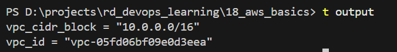
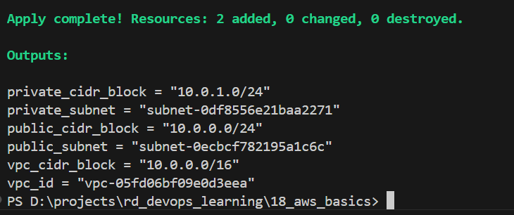
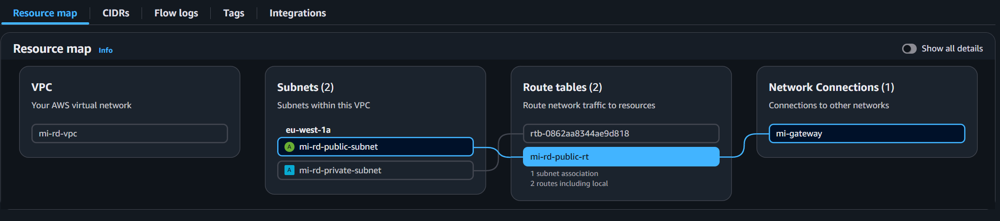

# AWS Basics

## Task 1: Create and configure VPC

### Step 0: Terraform setup

- Create `main.tf`, `outputs.tf`, `variables.tf`.
- Configure AWS provider and region in `main.tf`.
- Run: `terraform init`

### Step 1: Create a new VPC

Add to `main.tf`:

```hcl
resource "aws_vpc" "mi-vpc" {
  cidr_block = "10.0.0.0/16"
  tags = {
    Name    = "mi-rd-vpc"
    project = var.project_tag
  }
}
```

Run: `terraform apply`



### Step 2: Add subnets to VPC

Add to `main.tf`:

```hcl
resource "aws_subnet" "mi-public-subnet" {
  vpc_id     = aws_vpc.mi-vpc.id
  cidr_block = "10.0.0.0/24"
  tags = { Name = "mi-rd-public-subnet"; project = var.project_tag }
}

resource "aws_subnet" "mi-private-subnet" {
  vpc_id     = aws_vpc.mi-vpc.id
  cidr_block = "10.0.1.0/24"
  tags = { Name = "mi-rd-private-subnet"; project = var.project_tag }
}
```

Run: `terraform apply`



### Step 3: Internet Gateway and public routing

Add to `main.tf`: IGW, route table (0.0.0.0/0 → IGW), and route table association for the public subnet.

```hcl
resource "aws_internet_gateway" "mi-gateway" {
  vpc_id = aws_vpc.mi-vpc.id
  tags = { Name = "mi-gateway"; project = var.project_tag }
}

resource "aws_route_table" "mi-public-rt" {
  vpc_id = aws_vpc.mi-vpc.id
  route {
    cidr_block = "0.0.0.0/0"
    gateway_id = aws_internet_gateway.mi-gateway.id
  }
  tags = { Name = "mi-rd-public-rt"; project = var.project_tag }
}

resource "aws_route_table_association" "mi-public-subnet-assoc" {
  subnet_id      = aws_subnet.mi-public-subnet.id
  route_table_id = aws_route_table.mi-public-rt.id
}
```

Run: `terraform apply`



---

## Task 2: Security Groups and Network ACLs

### Step 1: Create Security Group with SSH and HTTP access

Add to `main.tf`:

```hcl
resource "aws_security_group" "mi-ec2-sg" {
  name        = "mi-rd-ec2-sg"
  description = "Security group for EC2 instance - allows SSH and HTTP access"
  vpc_id      = aws_vpc.mi-vpc.id

  ingress {
    description = "SSH from anywhere"
    from_port   = 22
    to_port     = 22
    protocol    = "tcp"
    cidr_blocks = ["0.0.0.0/0"]
  }

  ingress {
    description = "HTTP from anywhere"
    from_port   = 80
    to_port     = 80
    protocol    = "tcp"
    cidr_blocks = ["0.0.0.0/0"]
  }

  ingress {
    description = "HTTPS from anywhere"
    from_port   = 443
    to_port     = 443
    protocol    = "tcp"
    cidr_blocks = ["0.0.0.0/0"]
  }

  egress {
    description = "Allow all outbound traffic"
    from_port   = 0
    to_port     = 0
    protocol    = "-1"
    cidr_blocks = ["0.0.0.0/0"]
  }

  tags = {
    Name    = "mi-rd-ec2-sg"
    project = var.project_tag
  }
}
```

Run: `terraform apply`

---

## Task 3: Launch EC2 Instance

### Step 1: Generate SSH key pair

Generate SSH key pair for EC2 access:

```bash
ssh-keygen -t rsa -b 4096 -f mi-rd-ec2-key -N '""' -C "mi-rd-ec2-key"
```

This will create:
- `mi-rd-ec2-key` (private key)
- `mi-rd-ec2-key.pub` (public key)

### Step 2: Create AWS Key Pair resource

Add to `main.tf`:

```hcl
resource "aws_key_pair" "mi-ec2-key" {
  key_name   = "mi-rd-ec2-key"
  public_key = file("${path.module}/mi-rd-ec2-key.pub")

  tags = {
    Name    = "mi-rd-ec2-key"
    project = var.project_tag
  }
}
```

### Step 3: Launch EC2 instance with Amazon Linux 2

Add to `main.tf`:

```hcl
data "aws_ami" "amazon" {
  most_recent = true

  filter {
    name   = "name"
    values = ["amzn2-ami-hvm-*-x86_64-gp2"]
  }

  filter {
    name   = "virtualization-type"
    values = ["hvm"]
  }

  owners = ["amazon"]
}

resource "aws_instance" "mi_amazon_instance" {
  ami                         = data.aws_ami.amazon.id
  instance_type               = "t2.micro"
  subnet_id                   = aws_subnet.mi-public-subnet.id
  vpc_security_group_ids      = [aws_security_group.mi-ec2-sg.id]
  key_name                    = aws_key_pair.mi-ec2-key.key_name
  associate_public_ip_address = true

  tags = {
    Name    = "mi-rd-amazon-instance"
    project = var.project_tag
  }
}
```

Run: `terraform apply`

---

## Task 4: Assign Elastic IP (EIP)

### Step 1: Create and attach Elastic IP

Add to `main.tf`:

```hcl
resource "aws_eip" "mi-ec2-eip" {
  instance = aws_instance.mi_amazon_instance.id
  domain   = "vpc"

  tags = {
    Name    = "mi-rd-ec2-eip"
    project = var.project_tag
  }

  depends_on = [aws_internet_gateway.mi-gateway]
}
```

### Step 2: Update output

Add to `outputs.tf`:

```hcl
output "elastic_ip" {
  description = "Elastic IP details"
  value = {
    id            = aws_eip.mi-ec2-eip.id
    public_ip     = aws_eip.mi-ec2-eip.public_ip
    allocation_id = aws_eip.mi-ec2-eip.allocation_id
  }
}

output "ssh_connection" {
  description = "SSH connection command"
  value       = "ssh -i mi-rd-ec2-key ec2-user@${aws_eip.mi-ec2-eip.public_ip}"
}
```

Run: `terraform apply`

After applying, use the SSH command from the output to connect to your instance:

```bash
ssh -i mi-rd-ec2-key ec2-user@<ELASTIC_IP>
```