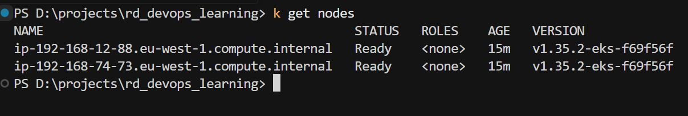
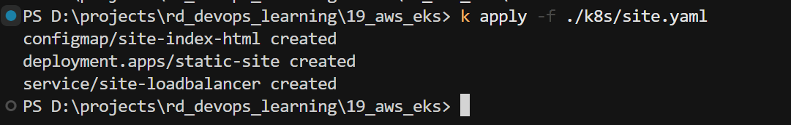
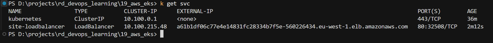
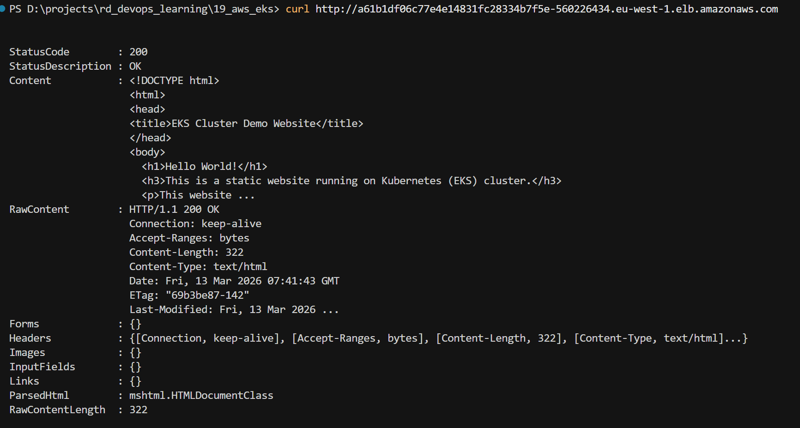
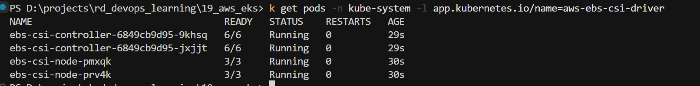
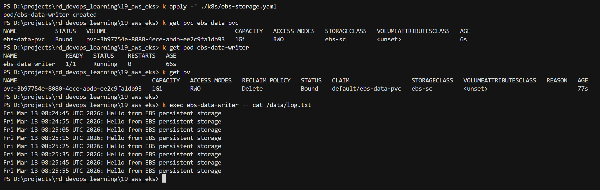
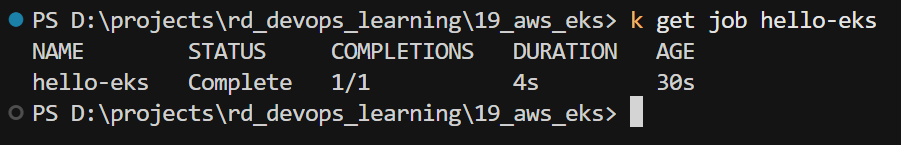
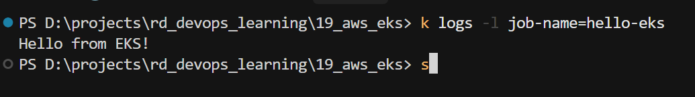

# AWS EKS

## [Task Description](TASK.md)

---

## Step 0 - Prerequisites

- For installing the cluster use `eksctl` - [GitHub](https://github.com/eksctl-io/eksctl)

> **Note:** Attempt to set up cluster via Terraform - currently not successful.

---

## Step 1 - Create EKS Cluster

Install cluster using `eksctl`:

```powershell
eksctl create cluster `
  --name rd-mi-cluster `
  --version 1.35 `
  --region eu-west-1 `
  --nodegroup-name rd-cluster-nodes `
  --node-type t3.medium `
  --nodes 2
```

`eksctl` automatically installs credentials for `kubectl`. To connect, just switch the context.

Use [`kubectx`](https://github.com/ahmetb/kubectx) to switch contexts.

If credentials are not set up, run:

```powershell
aws eks update-kubeconfig --region eu-west-1 --name rd-mi-cluster
```

**Aliases configured for future use:**

| Alias | Command    |
|-------|------------|
| `k`   | `kubectl`  |
| `kx`  | `kubectx`  |
| `kn`  | `kubens`   |

---

## Step 2 - Verify Cluster Nodes

Get cluster nodes from local machine:

```powershell
k get nodes
```




---

## Step 3 - Deploy Static Site

Apply site configuration, which includes:
- **ConfigMap** - provides the static `index.html` content
- **Deployment** - runs 2 nginx replicas serving the site
- **Service** (LoadBalancer) - exposes the site via a public AWS ELB

```powershell
k apply -f ./k8s/site.yaml
```



Get the external IP from `site-loadbalancer`:

```powershell
k get svc
```



Verify the site is reachable (replace with your ELB hostname from `k get svc`):

```powershell
curl http://<elb-hostname>.eu-west-1.elb.amazonaws.com
```



---

## Step 4 - Persistent Storage with EBS (PVC)

### Prerequisites — Install the AWS EBS CSI Driver

Dynamic EBS provisioning requires the EBS CSI Driver addon with proper IAM permissions.

**Create the OIDC Provider**
```powershell
eksctl utils associate-iam-oidc-provider `
  --region=eu-west-1 `
  --cluster=rd-mi-cluster `
  --approve
```

**Create the IAM Role**

```powershell
eksctl create iamserviceaccount `
  --region eu-west-1 `
  --name ebs-csi-ctl-sa `
  --namespace kube-system `
  --cluster rd-mi-cluster `
  --role-name EBS-CSI-Driver-Role `
  --role-only `
  --attach-policy-arn arn:aws:iam::aws:policy/service-role/AmazonEBSCSIDriverPolicy `
  --approve
```

**Install the EBS CSI Driver addon**:

> To get the ARN of the created role: `eksctl get iamserviceaccount --cluster rd-mi-cluster`

```powershell
eksctl create addon `
  --name aws-ebs-csi-driver `
  --cluster rd-mi-cluster `
  --region eu-west-1 `
  --service-account-role-arn arn:aws:iam::071894242597:role/EBS-CSI-Driver-Role `
  --force
```

Verify the driver pods are running:

```powershell
k get pods -n kube-system -l app.kubernetes.io/name=aws-ebs-csi-driver
```



### Apply the EBS Storage Manifest

The manifest `k8s/ebs-storage.yaml` contains three resources:

| Resource | Name | Purpose |
|---|---|---|
| `StorageClass` | `ebs-sc` | Defines dynamic EBS (`gp3`) provisioning |
| `PersistentVolumeClaim` | `ebs-data-pvc` | Requests 1 Gi of EBS storage |
| `Pod` | `ebs-data-writer` | Writes timestamped logs to the EBS volume |

> **Note:** `volumeBindingMode: WaitForFirstConsumer` delays EBS volume creation until a Pod is scheduled, ensuring the volume is created in the same Availability Zone as the node.

```powershell
k apply -f ./k8s/ebs-storage.yaml
```

### Verify Resources

Check that the PVC is bound (status changes from `Pending` → `Bound` once the Pod is scheduled):

```powershell
k get pvc ebs-data-pvc
```

Check the Pod is running:

```powershell
k get pod ebs-data-writer
```

Check the EBS volume was dynamically provisioned:

```powershell
k get pv
```

### Verify Data is Being Written

Read the log file from inside the running Pod:

```powershell
k exec ebs-data-writer -- cat /data/log.txt
```



---

## Step 5 - Run a Task Using a Job

The manifest `k8s/hello-job.yaml`:

```powershell
k apply -f ./k8s/hello-job.yaml
```

### Verify the Job completed

```powershell
k get job hello-eks
```


Read the output printed by the Job:

```powershell
k logs -l job-name=hello-eks
```
