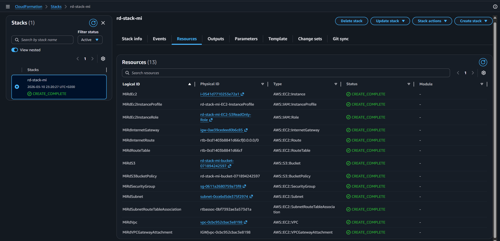
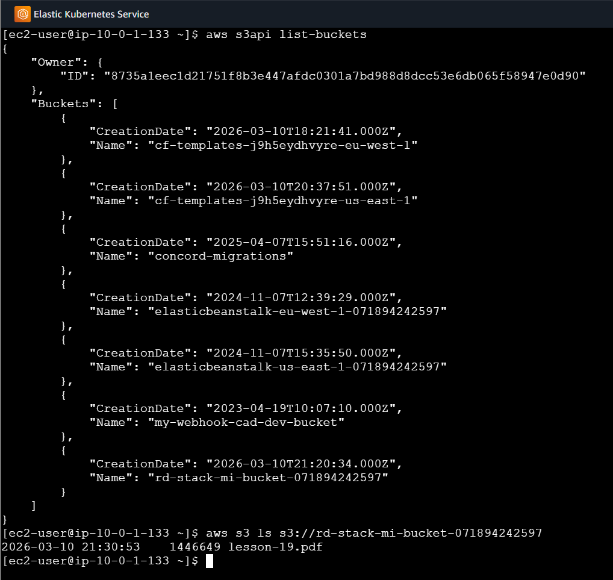
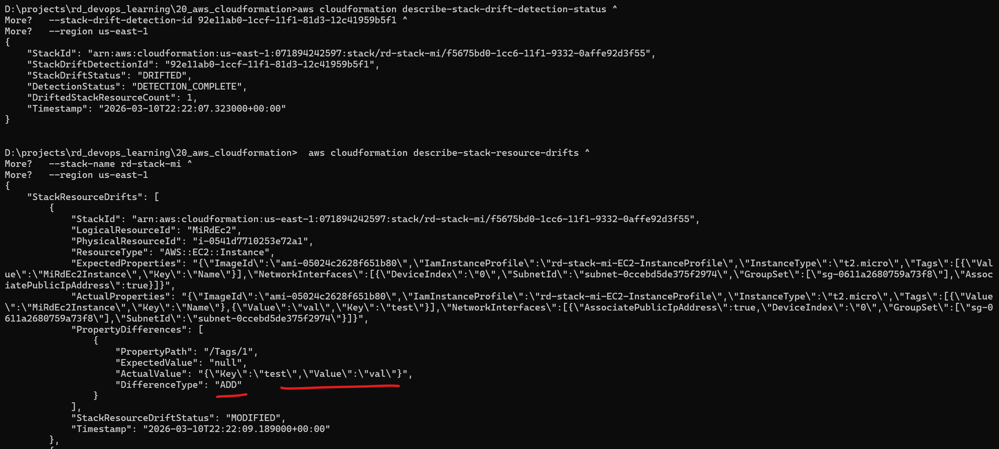

# AWS CloudFormation

## Task 1: Create Infrastructure with CloudFormation

### Overview

Using CloudFormation, create infrastructure that includes:
- **VPC** – Virtual Private Cloud
- **EC2 Instance** – Virtual machine in the created VPC
- **IAM Role** – Role for S3 bucket access
- **S3 Bucket** – Private bucket for data storage

### Step 0: Prerequisites

Ensure you have:
- AWS CLI configured with appropriate credentials
- Proper IAM permissions to create VPC, EC2, IAM roles, and S3 resources

### Step 1: Define Parameters

Define configurable parameters for the infrastructure in [`main.yaml`](./main.yaml):

```yaml
Parameters:
  VpcCidrBlock:
    Type: String
    Default: 10.0.0.0/16
    Description: The VPC CIDR block.
  SubnetCidrBlock:
    Type: String
    Default: 10.0.1.0/24
    Description: The Subnet CIDR block.
  AvailabilityZone:
    Type: AWS::EC2::AvailabilityZone::Name
    Default: us-east-1a
    Description: The availability zone for the subnet.
  ImageIdParameter:
    Type: AWS::SSM::Parameter::Value<AWS::EC2::Image::Id>
    Default: /aws/service/ami-amazon-linux-latest/amzn2-ami-hvm-x86_64-gp2
    Description: The AMI ID to use for the EC2 instance (automatically fetches latest Amazon Linux 2).
  InstanceTypeParameter:
    Type: String
    Default: t2.micro
    Description: The EC2 instance type.
```

### Step 2: Create VPC Infrastructure

Create a VPC with the following specifications:
- CIDR block: `10.0.0.0/16` (configurable via parameters)
- Public subnet: `10.0.1.0/24` in availability zone `us-east-1a`
- Internet Gateway for internet access
- Route Table configured with internet access (0.0.0.0/0 → IGW)

Add to [`main.yaml`](./main.yaml):

```yaml
Resources:
  MiRdVpc:
    Type: AWS::EC2::VPC
    Properties:
      CidrBlock: !Ref VpcCidrBlock
      EnableDnsHostnames: true
      EnableDnsSupport: true
      Tags:
        - Key: Name
          Value: MiRdVpc
  
  MiRdSubnet:
    Type: AWS::EC2::Subnet
    Properties:
      CidrBlock: !Ref SubnetCidrBlock
      VpcId: !Ref MiRdVpc
      AvailabilityZone: !Ref AvailabilityZone
      MapPublicIpOnLaunch: true
      Tags:
        - Key: Name
          Value: MiRdSubnet
  
  MiRdInternetGateway:
    Type: AWS::EC2::InternetGateway
    Properties:
      Tags:
        - Key: Name
          Value: MiRdInternetGateway
  
  MiRdVPCGatewayAttachment:
    Type: AWS::EC2::VPCGatewayAttachment
    Properties:
      VpcId: !Ref MiRdVpc
      InternetGatewayId: !Ref MiRdInternetGateway
  
  MiRdRouteTable:
    Type: AWS::EC2::RouteTable
    Properties:
      VpcId: !Ref MiRdVpc
      Tags:
        - Key: Name
          Value: MiRdRouteTable
  
  MiRdInternetRoute:
    Type: AWS::EC2::Route
    DependsOn: MiRdVPCGatewayAttachment
    Properties:
      RouteTableId: !Ref MiRdRouteTable
      DestinationCidrBlock: 0.0.0.0/0
      GatewayId: !Ref MiRdInternetGateway
  
  MiRdSubnetRouteTableAssociation:
    Type: AWS::EC2::SubnetRouteTableAssociation
    Properties:
      SubnetId: !Ref MiRdSubnet
      RouteTableId: !Ref MiRdRouteTable
```

### Step 3: Create IAM Role for S3 Access

Create an IAM role with S3 read-only access policy:

```yaml
  MiRdEc2InstanceRole:
    Type: AWS::IAM::Role
    Properties:
      RoleName: !Sub "${AWS::StackName}-EC2-S3ReadOnly-Role"
      AssumeRolePolicyDocument:
        Version: '2012-10-17'
        Statement:
          - Effect: Allow
            Principal:
              Service: ec2.amazonaws.com
            Action: sts:AssumeRole
      ManagedPolicyArns:
        - arn:aws:iam::aws:policy/AmazonS3ReadOnlyAccess
      Tags:
        - Key: Name
          Value: MiRdEc2InstanceRole
  
  MiRdEc2InstanceProfile:
    Type: AWS::IAM::InstanceProfile
    Properties:
      Roles:
        - !Ref MiRdEc2InstanceRole
      InstanceProfileName: !Sub "${AWS::StackName}-EC2-InstanceProfile"
```

### Step 4: Create S3 Bucket with Policy

Create an S3 bucket with a unique name, versioning enabled, and bucket policy that denies insecure connections and allows EC2 role access:

```yaml
  MiRdS3:
    Type: AWS::S3::Bucket
    Properties:
      BucketName: !Sub "${AWS::StackName}-bucket-${AWS::AccountId}"
      VersioningConfiguration:
        Status: Enabled
      PublicAccessBlockConfiguration:
        BlockPublicAcls: true
        BlockPublicPolicy: true
        IgnorePublicAcls: true
        RestrictPublicBuckets: true
      Tags:
        - Key: Name
          Value: MiRdS3Bucket
  
  MiRdS3BucketPolicy:
    Type: AWS::S3::BucketPolicy
    Properties:
      Bucket: !Ref MiRdS3
      PolicyDocument:
        Version: '2012-10-17'
        Statement:
          - Sid: DenyInsecureConnections
            Effect: Deny
            Principal: '*'
            Action: 's3:*'
            Resource:
              - !Sub "${MiRdS3.Arn}/*"
              - !GetAtt MiRdS3.Arn
            Condition:
              Bool:
                'aws:SecureTransport': false
          - Sid: AllowEC2RoleAccess
            Effect: Allow
            Principal:
              AWS: !GetAtt MiRdEc2InstanceRole.Arn
            Action:
              - 's3:GetObject'
              - 's3:ListBucket'
            Resource:
              - !Sub "${MiRdS3.Arn}/*"
              - !GetAtt MiRdS3.Arn
```

### Step 5: Create Security Group and Launch EC2 Instance

Create a security group allowing SSH access and launch an EC2 instance:
- Instance type: `t2.micro` (configurable via parameters)
- AMI: Latest Amazon Linux 2 (automatically fetched via SSM Parameter)
- Subnet: Public subnet with public IP assignment
- IAM Role: Role created in Step 3

```yaml
  MiRdSecurityGroup:
    Type: AWS::EC2::SecurityGroup
    Properties:
      GroupDescription: Security group for EC2 instance
      VpcId: !Ref MiRdVpc
      SecurityGroupIngress:
        - IpProtocol: tcp
          FromPort: 22
          ToPort: 22
          CidrIp: 0.0.0.0/0
      SecurityGroupEgress:
        - IpProtocol: -1
          CidrIp: 0.0.0.0/0
      Tags:
        - Key: Name
          Value: MiRdSecurityGroup

  MiRdEc2:
    Type: AWS::EC2::Instance
    Properties:
      ImageId: !Ref ImageIdParameter
      InstanceType: !Ref InstanceTypeParameter
      IamInstanceProfile: !Ref MiRdEc2InstanceProfile
      NetworkInterfaces:
        - AssociatePublicIpAddress: true
          DeviceIndex: 0
          SubnetId: !Ref MiRdSubnet
          GroupSet:
            - !Ref MiRdSecurityGroup
      Tags:
        - Key: Name
          Value: MiRdEc2Instance
```

### Step 6: Define Outputs

Add outputs to display the EC2 public IP and S3 bucket name with stack-based export names:

```yaml
Outputs:
  EC2PublicIP:
    Description: Public IP address of the EC2 instance
    Value: !GetAtt MiRdEc2.PublicIp
    Export:
      Name: !Sub "${AWS::StackName}-EC2-PublicIP"

  S3BucketName:
    Description: Name of the created S3 bucket
    Value: !Ref MiRdS3
    Export:
      Name: !Sub "${AWS::StackName}-S3-BucketName"
```

### Step 7: Deploy the Stack

Deploy the CloudFormation stack:

```bash
aws cloudformation create-stack \
  --stack-name rd-stack-mi \
  --template-body file://main.yaml \
  --capabilities CAPABILITY_IAM \
  --region us-east-1
```

Monitor stack creation:

```bash
aws cloudformation describe-stacks --stack-name rd-stack-mi --region us-east-1
```



### Step 8: Verify S3 Access from EC2

SSH into the EC2 instance and verify access to the S3 bucket:

```bash
# Test S3 access
aws s3 ls s3://rd-stack-mi-bucket-<ACCOUNT-ID>
```



---

## Task 2: Drift Detection

### Step 1: Manually Modify Resources

Make manual changes to deployed resources outside of CloudFormation to simulate configuration drift:
- Modify EC2 instance tags via AWS Console

### Step 2: Detect Drift

Initiate drift detection on the CloudFormation stack:

```bash
aws cloudformation detect-stack-drift --stack-name rd-stack-mi --region us-east-1
```

Get the drift detection ID from the output, then check the status:

```bash
aws cloudformation describe-stack-drift-detection-status \
  --stack-drift-detection-id <DRIFT-DETECTION-ID> \
  --region us-east-1
```

### Step 3: Review Drift Results

Once detection is complete, review which resources have drifted:

```bash
aws cloudformation describe-stack-resource-drifts \
  --stack-name rd-stack-mi \
  --region us-east-1
```



---

## Cleanup

Delete the CloudFormation stack and all created resources:

```bash
aws cloudformation delete-stack --stack-name rd-stack-mi --region us-east-1
```

Verify deletion:

```bash
aws cloudformation describe-stacks --stack-name rd-stack-mi --region us-east-1
``` 
