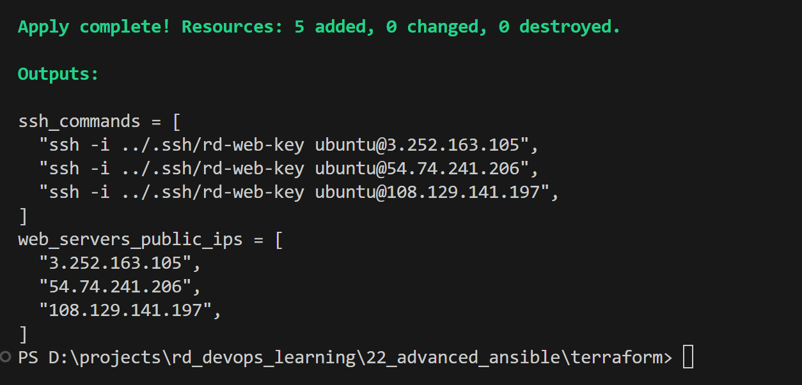
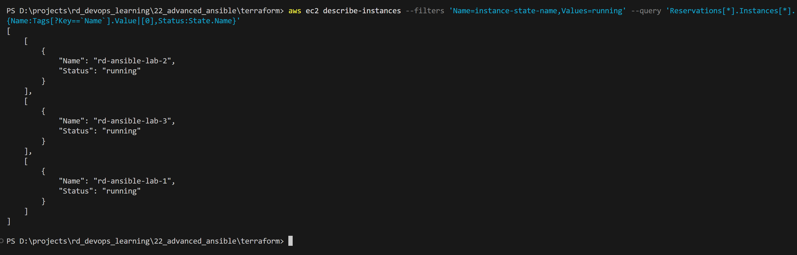
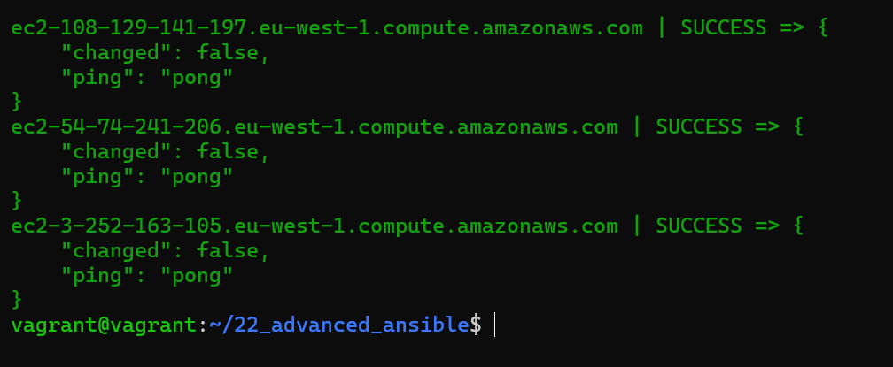
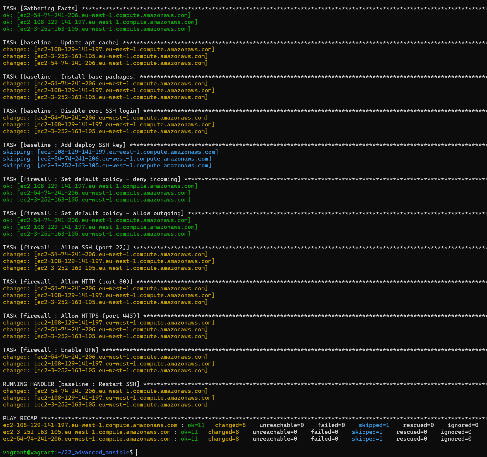
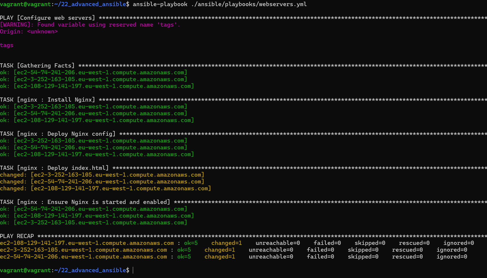
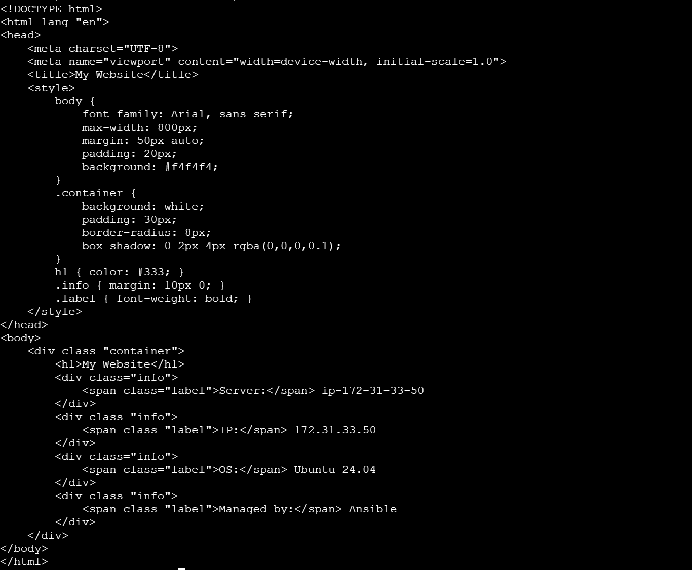
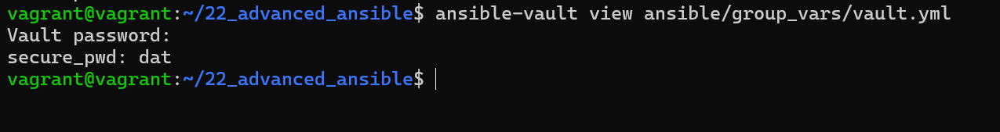

# Advanced Ansible

## Step 1: Prepare Infrastructure

### Generate SSH key

```bash
ssh-keygen -t rsa -b 4096 -f ./.ssh/rd-web-key
```

### Deploy EC2 instances with Terraform

```bash
cd terraform
terraform init
terraform apply
```

Terraform creates:
- 3 EC2 instances (Ubuntu 24.04)
- Security Group with SSH (22) and HTTP (80) access
- Tags: `Ansible=true`, `Role=web`





## Step 2: Configure Ansible

**Important**: Run all Ansible commands from the project root directory (`22_advanced_ansible/`).

### Install required collections

```bash
ansible-galaxy collection install ansible.posix
ansible-galaxy collection install community.general
ansible-galaxy collection install amazon.aws
```
#### Install boto3 for AWS dynamic inventory
```bash
sudo apt update
sudo apt install python3-boto3 python3-botocore
```

### Verify connectivity

```bash
ansible all -m ping
```



## Step 3: Deploy Baseline Configuration

The `baseline` role configures:
- Updates apt cache
- Installs base packages (vim, git, mc, ufw, curl, htop)
- Disables root SSH login
- Adds deploy SSH key

```bash
ansible-playbook ansible/playbooks/security.yml
```

## Step 4: Configure Firewall

The `firewall` role sets up UFW:
- Default policy: deny incoming, allow outgoing
- Allow SSH (22), HTTP (80), HTTPS (443)
- Enable UFW

Result of steps 3 and 4:


## Step 5: Deploy Nginx

The `nginx` role:
- Installs Nginx
- Deploys config from template
- Creates unique index.html per server using Jinja2
- Ensures Nginx is running

```bash
ansible-playbook ansible/playbooks/webservers.yml
```



Access web servers via their public IPs to see unique pages.



## Step 7: Working with Ansible Vault

### Encrypt sensitive data

```bash
ansible-vault create ansible/group_vars/vault.yml
```



### View encrypted file

```bash
ansible-vault view ansible/group_vars/vault.yml
```

### Edit encrypted file

```bash
ansible-vault edit ansible/group_vars/vault.yml
```