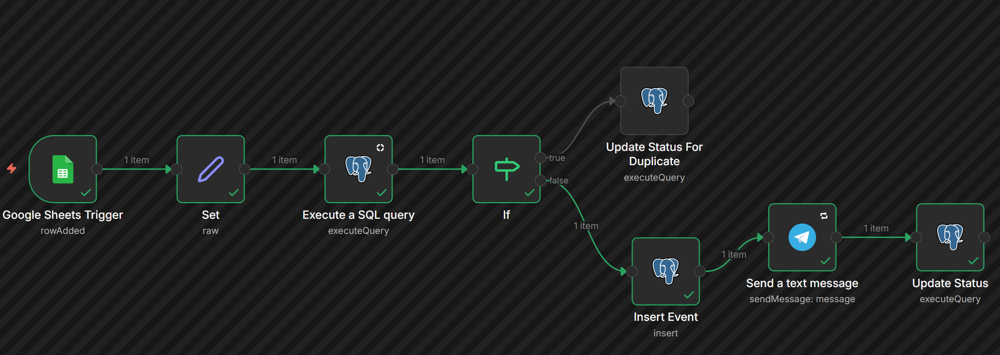
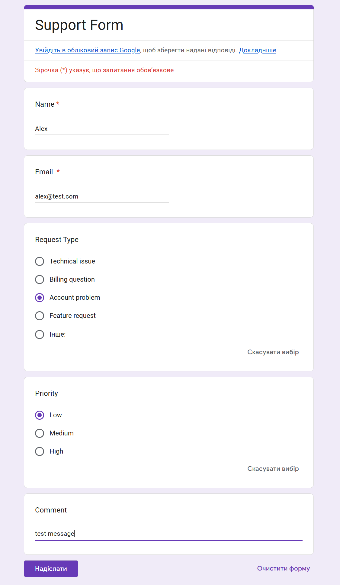
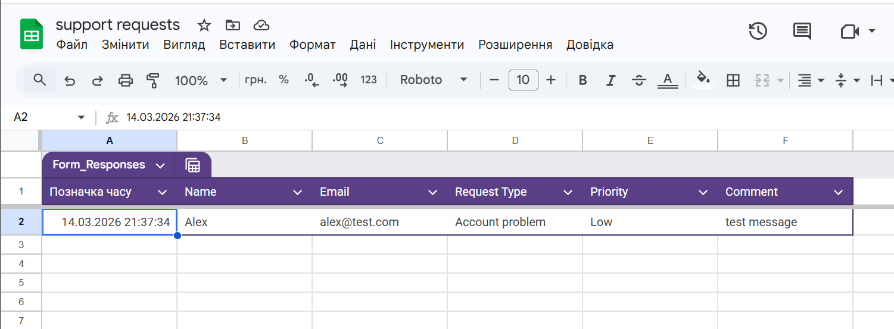
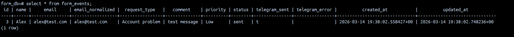
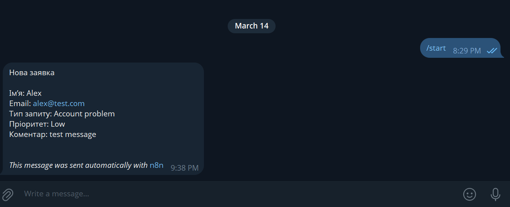
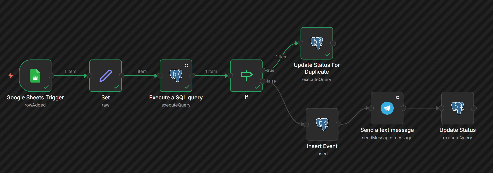
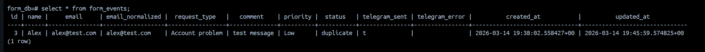

# LLM Usage in Infrastructure Tasks

## Task: Build an Automated Ticketing System with n8n, Google Forms, and Telegram

This project demonstrates how to create an automated workflow that captures user feedback via Google Forms and sends notifications to Telegram, with deduplication and retry mechanisms.

---

## Step 1: Deploy Your Own n8n Installation

### 1.1 Setup Docker Compose for n8n

Create a `docker-compose.yaml` file following the official n8n documentation:
https://docs.n8n.io/hosting/installation/server-setups/docker-compose/

The setup includes:
- **n8n** container on port 5678
- **PostgreSQL** database for storing form events and status tracking

```bash
docker-compose up -d
```

Access n8n at http://localhost:5678

### 1.2 Setup PostgreSQL Database

Create the `form_events` table to store form submissions:

```sql
CREATE TABLE form_events (
    id SERIAL PRIMARY KEY,
    name VARCHAR(255) NOT NULL,
    email VARCHAR(255) NOT NULL,
    email_normalized VARCHAR(255) NOT NULL,
    request_type VARCHAR(100),
    comment TEXT,
    priority VARCHAR(50),
    status VARCHAR(50) NOT NULL,
    telegram_sent BOOLEAN DEFAULT FALSE,
    telegram_error TEXT,
    created_at TIMESTAMP DEFAULT NOW(),
    updated_at TIMESTAMP DEFAULT NOW()
);

CREATE INDEX idx_email_normalized ON form_events(email_normalized);
```

---

## Step 2: Create a Google Form

### 2.1 Build the Form

Go to [Google Forms](https://forms.google.com) and create a new form with the following fields:

- **Name** (Short answer, Required)
- **Email** (Short answer, Required, Email validation)
- **Request Type** (Dropdown: Bug Report, Feature Request, Support, Other)
- **Problem Description / Comment** (Paragraph)
- **Priority** (Multiple choice: Low, Medium, High)

### 2.2 Configure Form Settings

- Enable "Collect email addresses" in Settings
- Link form responses to Google Sheets (Responses tab → Link to Sheets)
- Note the Google Sheet ID for n8n integration

### 2.3 Google Sheet Structure

The linked Google Sheet will have columns:
- Позначка часу (Timestamp)
- Name
- Email
- Request Type
- Priority
- Comment

---

## Step 3: Create a Telegram Bot

### 3.1 Create Bot via BotFather

Open Telegram and search for [@BotFather](https://t.me/botfather)

```
/newbot
```

Follow the prompts to:
- Choose a name for your bot
- Choose a username (must end in 'bot')
- Save the Bot Token provided

### 3.2 Get Chat ID

**Option 1: Personal Chat**
- Send a message to your bot
- Visit: `https://api.telegram.org/bot<YOUR_BOT_TOKEN>/getUpdates`
- Find the `chat.id` in the response

**Option 2: Group Chat**
- Add the bot to a group
- Send a message mentioning the bot
- Use the same URL to get the group `chat.id` (will be negative)

---

## Step 4: Build the n8n Workflow

### 4.1 Workflow Overview

The workflow implements:
1. **Google Sheets Trigger** - Monitors the form responses sheet for new rows
2. **Data Transformation** - Normalizes email addresses and formats data
3. **Deduplication Check** - Queries PostgreSQL for existing emails
4. **Conditional Logic** - Routes to duplicate or new record handling
5. **Database Insert** - Stores new requests with status tracking
6. **Telegram Notification** - Sends formatted message with retry mechanism
7. **Status Update** - Marks records as sent or duplicate

### 4.2 Configure Trigger Node

In n8n, add a **Google Sheets Trigger** node:
- **Operation**: Row Added
- **Poll Time**: Every minute
- Connect your Google account
- Select the Google Sheet linked to your form
- Choose the correct sheet tab (usually "Відповіді форми (1)")

### 4.3 Data Transformation (Set Node)

Add a **Set** node to transform and normalize the data:

```javascript
{
  "name": "{{ $json.Name }}",
  "email": "{{ $json['Email '] }}",
  "email_normalized": "{{ $json['Email '].toLowerCase().trim() }}",
  "request_type": "{{ $json['Request Type '] }}",
  "priority": "{{ $json.Priority }}",
  "comment": "{{ $json.Comment }}"
}
```

### 4.4 Email Deduplication Check

Add a **PostgreSQL** node ("Execute a SQL query") to check for existing emails:

```sql
SELECT id, email_normalized, status
FROM form_events
WHERE email_normalized = $1
LIMIT 1;
```

- **Query Replacement**: `{{ $json.email_normalized }}`
- **Always Output Data**: Enabled

### 4.5 Conditional Routing (IF Node)

Add an **IF** node to check if a record exists:

**Condition**: `{{ $json.id }}` exists
- **True (Duplicate)** → Update status to 'duplicate'
- **False (New)** → Insert new record and send Telegram message

### 4.6 Handle Duplicates

Add a **PostgreSQL** node ("Update Status For Duplicate"):

```sql
UPDATE form_events
SET
    status = 'duplicate',
    updated_at = NOW()
WHERE email_normalized = $1;
```

### 4.7 Insert New Event

Add a **PostgreSQL** node ("Insert Event") for new submissions:

**Table**: `form_events`

**Column Mappings**:
- `name` = `{{ $('Set').item.json.name }}`
- `email` = `{{ $('Set').item.json.email }}`
- `email_normalized` = `{{ $('Set').item.json.email_normalized }}`
- `request_type` = `{{ $('Set').item.json.request_type }}`
- `comment` = `{{ $('Set').item.json.comment }}`
- `priority` = `{{ $('Set').item.json.priority }}`
- `status` = `'new'`
- `telegram_sent` = `false`


### 4.8 Send Telegram Notification

Add a **Telegram** node ("Send a text message"):

**Configuration**:
- **Chat ID**: Your chat ID (e.g., 390478444)
- **Text**: Formatted message template

**Message Template**:

```
Нова заявка

Ім’я: {{$json.name}}
Email: {{$json.email}}
Тип запиту: {{$json.request_type}}
Пріоритет: {{$json.priority}}
Коментар: {{$json.comment}}

```

**Retry Settings**:
- **Retry On Fail**: Enabled
- **Wait Between Tries**: 5000ms (5 seconds)

### 4.9 Update Status After Sending

Add a **PostgreSQL** node ("Update Status") to mark the message as sent:

```sql
UPDATE form_events
SET
    status = 'sent',
    telegram_sent = true,
    telegram_error = null,
    updated_at = NOW()
WHERE id = $1;
```

- **Query Replacement**: `{{ $('Insert Event').item.json.id }}`

### 4.10 Final Workflow Structure

**Workflow Nodes**:
1. Google Sheets Trigger
2. Set (Data Transformation)
3. Execute a SQL query (Deduplication Check)
4. If (Conditional Logic)
5. Update Status For Duplicate (If duplicate path)
6. Insert Event (If new path)
7. Send a text message (Telegram)
8. Update Status (Mark as sent)



---

## Testing the System

### Submit Test Form

Fill out the Google Form with test data and submit.





### Verify Database Entry

Check that the ticket was stored in the database:

```sql
SELECT * FROM form_events ORDER BY created_at DESC LIMIT 5;
```

You should see:
- New records with `status = 'sent'` and `telegram_sent = true`
- Duplicate records with `status = 'duplicate'`



### Confirm Telegram Notification

Check your Telegram chat for the notification message.



### Test Deduplication

Submit the form again with the same email address and verify:
- A different message is sent (or no duplicate is created)
- The workflow handles it appropriately



