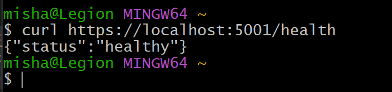
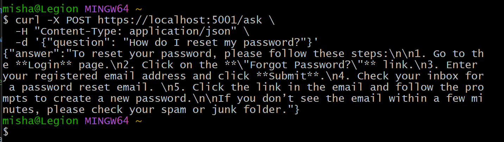
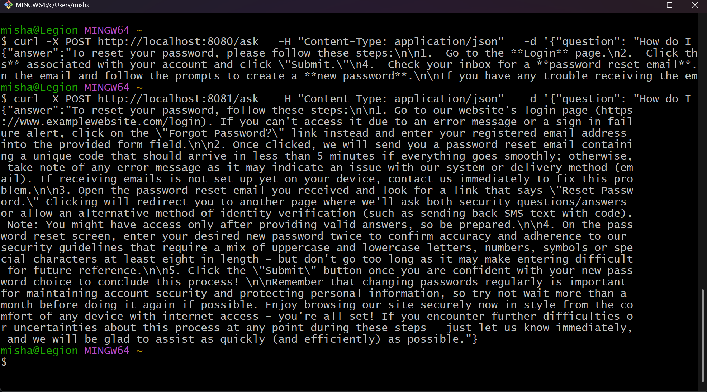

# Building an AI Service for Customer Support

A simple AI-powered customer support service built with ASP.NET Core, implementing integration with Google Gemini API.

## Features

- RESTful API with `/ask` endpoint
- Integration with Google Gemini API
- Retry logic with exponential backoff (3 attempts)
- Request timeout handling (30 seconds)
- Comprehensive request/response logging
- Docker containerization ready
- Health check endpoint

## Prerequisites

- .NET 10.0 SDK
- Gemini API key (get from [Google AI Studio](https://makersuite.google.com/app/apikey))
- Docker (optional, for containerization)

## Setup

### 1. Navigate to Project

```powershell
cd 24_mlops\ChatApi
```

### 2. Configure API Key

Edit `appsettings.json` and add your Gemini API key:

```json
{
  "Gemini": {
    "ApiKey": "your_actual_api_key_here"
  }
}
```

Or use environment variable (recommended for production):

```powershell
# PowerShell
$env:Gemini__ApiKey = "your_api_key_here"
```

### 3. Run Locally

```powershell
dotnet run
```

The service will start on `https://localhost:5001`

## Usage

### Health Check

```
curl https://localhost:5001/health
```


### Ask a Question

```bash
curl -X POST https://localhost:5001/ask \
  -H "Content-Type: application/json" \
  -d '{"question": "How do I reset my password?"}'
```



## Docker Deployment

### Using Docker Compose

Run both Gemini and Ollama-based services together:

```powershell
# Navigate to project root
cd 24_mlops

# Create .env file from example
Copy-Item .env.example .env
# Edit .env and add your Gemini API key

# OR set environment variable directly
$env:GEMINI_API_KEY = "your_api_key_here"

# Start all services
docker-compose up -d

# Pull Ollama model (first time only)
docker exec ollama ollama pull phi3
```

**Services:**
- **chatapi-gemini**: Gemini-based API on `http://localhost:8080`
- **chatapi-ollama**: Ollama-based API on `http://localhost:8081`
- **ollama**: Ollama model server on `http://localhost:11434`

**Test Gemini service:**
```bash
curl -X POST http://localhost:8080/ask \
  -H "Content-Type: application/json" \
  -d '{"question": "How do I reset my password?"}'
```

**Test Ollama service:**
```bash
curl -X POST http://localhost:8081/ask \
  -H "Content-Type: application/json" \
  -d '{"question": "How do I reset my password?"}'
```



### Key Differences Between Approaches

**Gemini (SaaS LLM):**
- ✅ Concise and clear responses
- ✅ Faster response time
- ✅ No local resource requirements
- ✅ Always up-to-date model
- ❌ Requires API key and internet connection
- ❌ Costs per API call
- ❌ Data sent to external service

**Ollama (Self-Hosted):**
- ✅ More detailed and comprehensive responses
- ✅ No external API costs
- ✅ Data stays local (privacy)
- ✅ Works offline
- ❌ Requires significant CPU/RAM
- ❌ Slower response time on CPU
- ❌ Manual model management and updates

