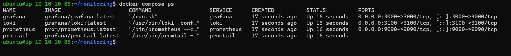
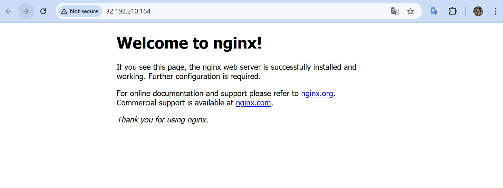
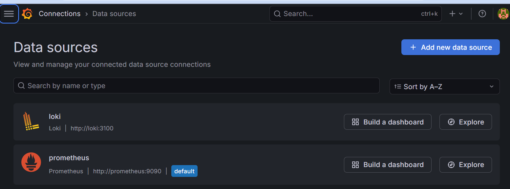
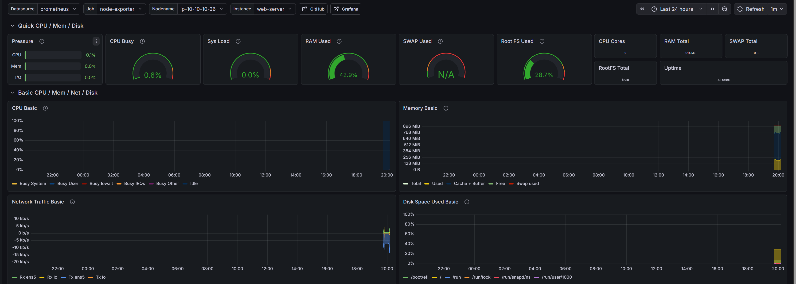
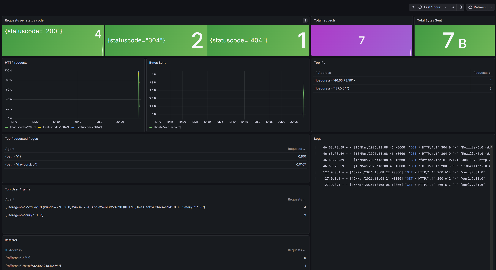
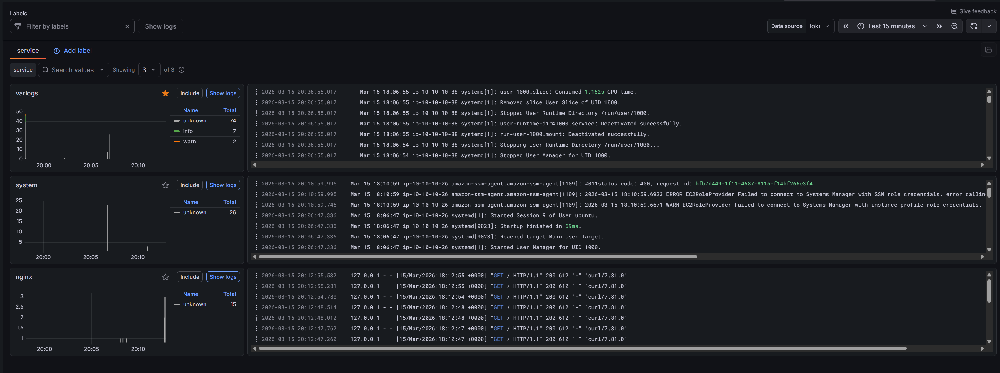

# Monitoring with Prometheus, Grafana, and Loki

## Task Overview

Deploy a comprehensive monitoring system for a web server using AWS EC2 infrastructure. The system collects metrics and logs from an Nginx web server and visualizes them using Prometheus, Grafana, and Loki.

### Components

- **Prometheus** - Metrics collection and storage
- **Grafana** - Metrics and logs visualization
- **Loki** - Log aggregation and storage
- **Promtail** - Log collection agent
- **Node Exporter** - System metrics exporter
- **Nginx Exporter** - Nginx metrics exporter

### Infrastructure

Two EC2 instances in a single VPC:
- **Monitoring Server** (t3.small) - Hosts Prometheus, Grafana, Loki, and Promtail
- **Web Server** (t3.micro) - Runs Nginx with exporters for monitoring

---

### Deployment Steps

#### Step 0: Prerequisites

Generate SSH key pair:

```bash
# From the project root directory
mkdir -p .ssh
ssh-keygen -t rsa -b 4096 -f .ssh/monitor-key -N "" -C "monitor-key"
```

This creates:
- `.ssh/monitor-key` (private key)
- `.ssh/monitor-key.pub` (public key)

The public key will be automatically imported to AWS by Terraform.

#### Step 1: Configure Variables

Edit [`terraform.tfvars`](terraform/terraform.tfvars) and update:

```hcl
my_ip = "YOUR_IP_ADDRESS/32"  # Your public IP for SSH access
```

#### Step 2: Initialize and Deploy

```bash
cd terraform
terraform init
terraform plan
terraform apply
```

Save the output values (public IPs) for later use.

---

## Monitoring Server Setup

### Step 1: Connect to Monitoring Server

```bash
ssh -i .ssh/monitor-key ubuntu@<MONITORING_SERVER_PUBLIC_IP>
```

### Step 2: Run Setup Script

Copy  [`monitoring/setup.sh`](monitoring/setup.sh) to the server and run:

```bash
chmod +x setup.sh
./setup.sh
```

This script:
- Installs Docker and Docker Compose
- Creates the monitoring directory structure
- Configures the ubuntu user for Docker

### Step 3: Deploy Monitoring Stack

Create the monitoring directory structure:

```bash
mkdir -p ~/monitoring/prometheus ~/monitoring/loki ~/monitoring/promtail
cd ~/monitoring
```

Copy the following files to the server:
- [`docker-compose.yml`](monitoring/docker-compose.yml)
- [`prometheus/prometheus.yml`](monitoring/prometheus/prometheus.yml)
- [`loki/loki-config.yml`](monitoring/loki/loki-config.yml)
- [`promtail/promtail-config.yml`](monitoring/promtail/promtail-config.yml)

Update [`prometheus/prometheus.yml`](monitoring/prometheus/prometheus.yml) with actual private IPs:

```yaml
  - job_name: 'node-exporter'
    static_configs:
      - targets: ['10.10.10.Y:9100']  # Web server private IP

  - job_name: 'nginx-exporter'
    static_configs:
      - targets: ['10.10.10.Y:9113']  # Web server private IP
```

### Step 4: Start the Stack

```bash
cd ~/monitoring
docker compose up -d
```

Verify services are running:

```bash
docker compose ps
```

### Access URLs

- **Prometheus**: `http://<MONITORING_SERVER_PUBLIC_IP>:9090`
- **Grafana**: `http://<MONITORING_SERVER_PUBLIC_IP>:3000` (admin/admin)
- **Loki**: `http://<MONITORING_SERVER_PUBLIC_IP>:3100`



---

## Web Server Setup

### Step 1: Connect to Web Server

```bash
ssh -i .ssh/monitor-key ubuntu@<WEB_SERVER_PUBLIC_IP>
```

### Step 2: Run Setup Script

Copy [`web-server/setup.sh`](web-server/setup.sh) to the server and run:

```bash
chmod +x setup.sh
./setup.sh
```

This script installs:
- **Nginx** - Web server (port 80)
- **Node Exporter** v1.8.2 - System metrics (port 9100)
- **Nginx Exporter** v1.3.0 - Nginx metrics (port 9113)
- **Promtail** v3.0.0 - Log collector

### Step 3: Configure Promtail

Copy [`web-server/promtail-config.yml`](web-server/promtail-config.yml) to `/etc/promtail/config.yml`:

```bash
sudo mkdir -p /etc/promtail
sudo cp promtail-config.yml /etc/promtail/config.yml
```

Update the Loki URL in the config with the monitoring server's private IP:

```yaml
clients:
  - url: http://10.10.10.X:3100/loki/api/v1/push  # Monitoring server private IP
```

Start Promtail:

```bash
sudo systemctl daemon-reload
sudo systemctl start promtail
sudo systemctl enable promtail
```

### Step 4: Verify Services

Check all services are running:

```bash
sudo systemctl status nginx
sudo systemctl status node_exporter
sudo systemctl status nginx_exporter
sudo systemctl status promtail
```

Test metrics endpoints:

```bash
curl http://localhost:9100/metrics  # Node Exporter
curl http://localhost:9113/metrics  # Nginx Exporter
```

### Nginx Configuration

The setup script configures Nginx with a stub_status endpoint for metrics collection:

```nginx
server {
    listen 8080;
    location /stub_status {
        stub_status on;
        allow 127.0.0.1;
        deny all;
    }
}
```

Verify Nginx welcome page is accessible:



---

## Grafana Configuration

### Step 1: Access Grafana

Open Grafana at `http://<MONITORING_SERVER_PUBLIC_IP>:3000`

Default credentials:
- Username: `admin`
- Password: `admin`

You'll be prompted to change the password on first login.

### Step 2: Add Data Sources

Navigate to: **Configuration → Data Sources → Add data source**

#### Prometheus Data Source

- **Name**: Prometheus
- **Type**: Prometheus
- **URL**: `http://prometheus:9090`
- Click **Save & Test**

#### Loki Data Source

- **Name**: Loki
- **Type**: Loki
- **URL**: `http://loki:3100`
- Click **Save & Test**



### Step 3: Import Dashboards

Navigate to: **Dashboards → Import**

#### Node Exporter Dashboard

- **Dashboard ID**: `1860`
- **Name**: Node Exporter Full
- **Data Source**: Prometheus
- Click **Import**

This dashboard shows:
- CPU usage and load
- Memory utilization
- Disk I/O and space
- Network traffic



#### Nginx Dashboard

- **Dashboard ID**: `12708`
- **Name**: NGINX by nginxinc
- **Data Source**: Prometheus
- Click **Import**

This dashboard shows:
- Active connections
- Requests per second
- Request handling time
- HTTP status codes



### Step 4: View Logs in Grafana

Navigate to: **Explore** → Select **Loki** data source

Query examples:

```logql
# All nginx access logs
{job="nginx", log_type="access"}

# Nginx error logs only
{job="nginx", log_type="error"}

# System logs from web server
{job="system", host="web-server"}
```


